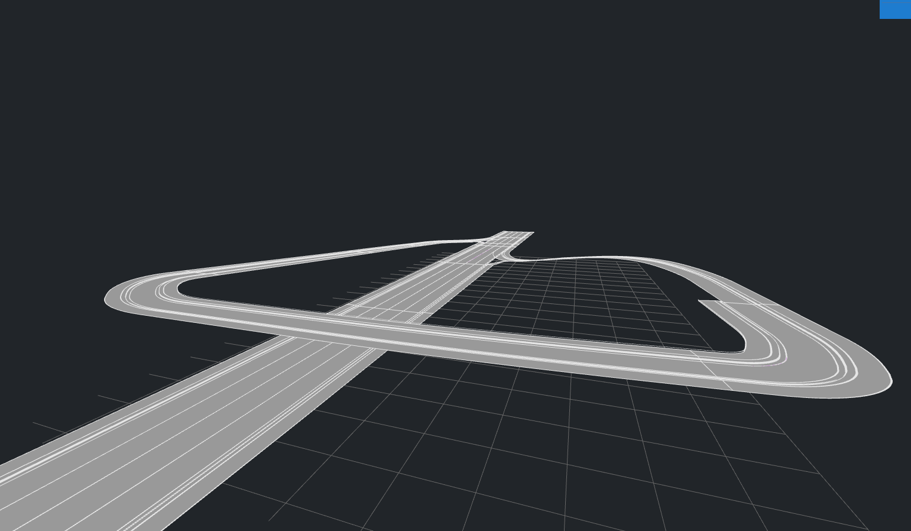
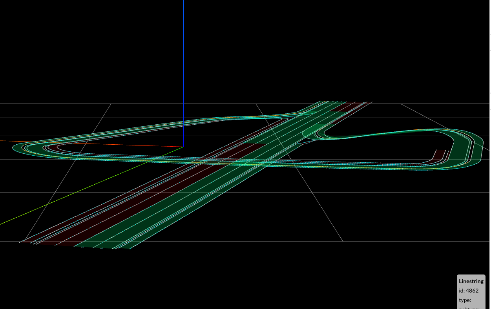

# CRD 3D Update Notes

This release introduces a complete 3D elevation pipeline: it reads elevation/superelevation/shape/lane height and signal zOffset from OpenDRIVE, computes and outputs Lanelet boundaries, StopLines, TrafficLights, and TrafficSigns with Z; and provides a one‑switch enable/disable with a 2D fallback. This document summarizes the new variables and features, usage, and a checklist of newly handled XODR elements.

## Overview

- 3D geometry generation: Lanelet left/right boundaries are sampled as 3D points (considering longitudinal elevation, superelevation, and cross-section shape), and per-lane local height (lane/height) is supported.
- 3D controls: TrafficSign/TrafficLight/StopLine positions include Z; StopLine endpoints are also written with Z.
- Elevation sources: centerline elevation + superelevation/shape projection + lane local height offset; controls add each object’s zOffset.
- 3D/2D switch: controlled by `open_drive_config.general_use_elevation_type_activ`; when disabled, everything falls back to 2D.
- Optional orthometric conversion: ellipsoidal heights can be converted to orthometric heights via the EGM96 geoid model when explicitly enabled.
- Writer support: auto-patch CommonRoad XML writer to write `<point>` with `<z>`.

Input *.xodr


Output *.osm


## New Variables and Capabilities

- Switch: `open_drive_config.general_use_elevation_type_activ` (default True)
  - Purpose: enable 3D elevation processing and export (Lanelet/StopLine/TrafficLight/TrafficSign with Z); disable to force 2D fallback.
  - Definition: `crdesigner/common/config/opendrive_config.py`
  - Effect: `crdesigner/common/file_writer.py` calls the 3D writer patch when True (see below).

- Orthometric conversion toggle: `open_drive_config.enable_orthometric_height_conversion` (default False)
  - Purpose: convert sampled ellipsoidal heights to orthometric heights using the EGM96 geoid grid (EPSG:7915 reference).
  - Definition: `crdesigner/common/config/opendrive_config.py`
  - Effect: `crdesigner/map_conversion/opendrive/odr2cr/opendrive_conversion/utils.py` initializes a PROJ transformer from the OpenDRIVE `<geoReference>` proj4 string (or `lanelet2_config.height_geoid_proj4` fallback) and runs `convert_height_ellipsoid_to_orthometric()` before elevations are stored in lane surfaces and control points.

- Writer patch: `patch_controls_write_3d()`
  - Location: `crdesigner/common/traffic_sign_node_elevation.py`
  - Effect: overrides CommonRoad-IO XML writer `create_node()` for TrafficSign/TrafficLight/StopLine so `<position>/<point>` and `<stopLine>/<point>` include `<z>`.
  - Trigger: called by `CRDesignerFileWriter` constructor when the 3D switch is True.

- ParametricLane additions (for 3D) in `plane.py`
  - Fields: `elevation_profile`, `superelevation`, `shape`, `offset_lanesection`, `offset_width`, `inner_parametric_lane_group`, `lane_height_records`, `level`.
  - Methods:
    - `calc_border_height(border, s, x_old, y_old, plane_curve_hdg)`: compute border height and XY correction (superelevation + shape projection), then add lane/height offset.
    - `calc_vertices_3d(error_tolerance, min_delta_s, transformer)`: sample 3D left/right vertices and aggregate ground surface samples `_all_surface_points`.
    - `calc_elevation_central(s)`, `calc_superelevation(s)`, `calc_shape(s,t)`: piecewise polynomial interpolation.

- ParametricLaneGroup (`plane_group.py`)
  - `set_elevation_profile(...)`, `set_superelevation(...)`: distribute laneSection‑scope curves to member ParametricLanes.
  - `calc_border_height(...)`: delegates to the underlying ParametricLane.

- Parser enhancements (`parser.py`, `roadLanes.py`, `roadSignal.py`)
  - Parse `lane/height@sOffset,inner,outer` (new class `height`).
  - Parse `signal/@zOffset` and `signalReference/@zOffset`.

- Conversion pipeline (`converter.py`, `network.py`)
  - Distribute elevation/superelevation/shape at laneSection scope; wire `offset_lanesection/offset_width`; persist `level`.
  - StopLine 3D generation (road surface Z + zOffset); TrafficSign/Light Z assignment (KDTree nearest surface Z + zOffset).
  - 2D fallback: when switch is off, call `convert_to_2d()`/drop Z to keep legacy behavior.
  - Matching improvements: 3D/2D distance (`geom_utils.dist`), StopLine fallback mapping to closest incoming lanelet endpoint.

- Geometry utilities (`geom_utils.py`)
  - `as_xy/as_xyz/dist`: unified 2D/3D point and distance handling.

## Usage

1) Enable/disable 3D export

```python
from crdesigner.common.config.opendrive_config import open_drive_config
open_drive_config.general_use_elevation_type_activ = True  # enable 3D (default)
```

2) Normal read/convert/write stays the same

- Use `CRDesignerFileReader` to read, MapConversion for conversion, and `CRDesignerFileWriter` to export.
- When 3D is enabled, TrafficSign/TrafficLight/StopLine nodes in XML include `<z>`.
- When 3D is disabled, the pipeline forces 2D (both lanelets and controls).

3) (Optional) Convert ellipsoidal heights to orthometric heights

```python
from crdesigner.common.config.opendrive_config import open_drive_config
from crdesigner.common.config.lanelet2_config import lanelet2_config

open_drive_config.enable_orthometric_height_conversion = True

# Optional: override the fallback proj4 string if your OpenDRIVE geoReference does not
# contain a geoid grid definition. The default expects the PROJ EGM96 grid (egm96_15.gtx).
lanelet2_config.height_geoid_proj4 = (
    "+proj=tmerc +lat_0=50.0 +lon_0=8.0 +datum=WGS84 +units=m "
    "+geoidgrids=egm96_15.gtx +vunits=m +no_defs"
)
```

- The transformer is initialized from the `<geoReference>` proj4 string if it carries a `geoidgrids=` entry; otherwise we fall back to `lanelet2_config.height_geoid_proj4`.
- Ensure the referenced grid file (e.g., `egm96_15.gtx`) is installed in your local PROJ data directory; otherwise the conversion silently returns the original ellipsoidal heights.
- When enabled, all sampled surface heights (centerline elevation, lane height records, control KD-tree queries) are converted before exporting the Lanelet/StopLine/TrafficLight/TrafficSign Z coordinates.


## Behavioral Changes and Compatibility

- Controls (signs/lights/stop lines) are exported with 3D coordinates (when enabled).
- Lanelet boundaries are computed from OpenDRIVE elevation/superelevation/shape/lane height and exported as 3D vertices.
- More robust matching:
  - TrafficLight → incoming lanelet association uses nearest end (supports 3D/2D distance).
  - StopLine: if length is missing, try validLength/length, then outline cornerLocal’s v range, and finally estimate from total drivable width; last resort uses a small constant to avoid degeneracy.
- With 3D disabled, the system falls back to legacy 2D behavior.

## XODR Processing Checklist (New/Enhanced)

| Semantic element | XODR element/attribute | Code entry (primary) |
|---|---|---|
| Traffic Light; Traffic Sign; Stopline| ` <OpenDRIVE> <road> <signals> <signal zOffset="..."/> </signal> </signals> </road> <OpenDRIVE> ` | crdesigner/map_conversion/opendrive/odr2cr/opendrive_conversion/network.py:875; `assign_control_heights_from_surface()`|
| Road height| `<OpenDRIVE> <road> <elevationProfile> <elevation s="..." a="..." b="..." c="..." d="..."/> </elevationProfile> </road> <OpenDRIVE>` | crdesigner/map_conversion/opendrive/odr2cr/opendrive_conversion/plane_elements/plane.py:439; `calc_vertices_3d()`; crdesigner/map_conversion/opendrive/odr2cr/opendrive_conversion/plane_elements/plane.py:590; `calc_border_height()` |
| Road lateral height | `<OpenDRIVE> <road> <lateralProfile> <superelevation s="..." a="..." b="..." c="..." d="..."/> <shapes s="..." t="..." a="..." b="..." c="..." d="..."/> /lateralProfile> </road> <OpenDRIVE>`  | crdesigner/map_conversion/opendrive/odr2cr/opendrive_conversion/plane_elements/plane.py:596; `correction_due_to_superelevation()` |
| Lane shoulder height | `<OpenDRIVE> <road> <lanes> <left / right> <lane> <height sOffset="..." inner="..." outer="..."/> </lane> </ left/right>  </lanes> </road> <OpenDRIVE>` | crdesigner/map_conversion/opendrive/odr2cr/opendrive_conversion/network.py:284 |

Line numbers point to the exact code locations at the time of this update.

## Height Reference Considerations

We have implemented and verified the conversion between ellipsoidal and orthometric heights based on the EGM96 geoid model. However, the OpenDRIVE specification does not state whether the `<elevation>` profile is expressed in ellipsoidal or orthometric heights, and `<geoReference>` only provides optional, non-binding hints.

Because of this ambiguity, different application contexts (GNSS alignment vs. DEM-based analysis, for example) might interpret the same file differently. Enabling the conversion path therefore introduces assumptions that go beyond what OpenDRIVE mandates and should only be done when you control the upstream height reference.

The conversion module is included in this delivery for completeness and reference; the CommonRoad development team can decide to keep or remove it (or change the default) once project requirements and standard alignment are clarified.

## Developer Notes (Internal API)

- `ParametricLane.calc_border_height(...)`
  - Pipeline: centerline `elevation` → `superelevation` + `shape` projection for height + XY correction → add `lane/height` (inner/outer via sOffset interpolation).
  - When `level=True`, projection is skipped (lane kept flat); elevation and lane/height still apply.

- `ParametricLane.calc_vertices_3d(...)`
  - Samples 3D left/right boundaries; with a transformer, outputs projected `(x,y,z)`; aggregates `_all_surface_points` for later control Z assignment.

- Control height assignment
  - TrafficSign/Light: KDTree nearest surface Z + object zOffset.
  - StopLine: compute road surface Z + object zOffset for both endpoints.

- 3D/2D distance
  - `geom_utils.dist(p1, p2, use_3d: bool)` for unified distance handling.
