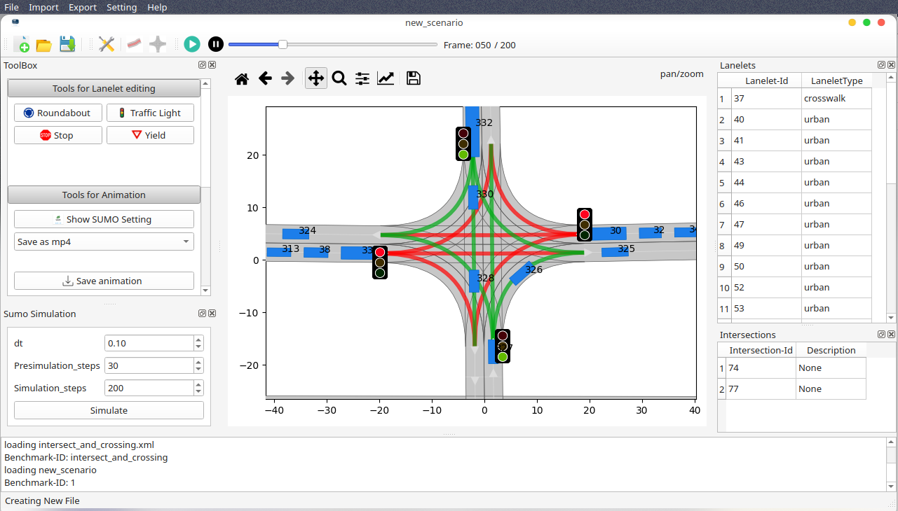

# CommonRoad Map Converter

This software provides multiple converters from different map formats to the CommonRoad map format.
This branch is under development for CommonRoad 2020a.
Commit 4abf24d380b2ddac2c2c71b210764c4ae5759406 is the last stable version for CommonRoad 2018b.

|         Tool         |                 Path                  |                            Functionality                            |
| :------------------: | :-----------------------------------: | :-----------------------------------------------------------------: |
|  opendrive2lanelet   |      `crmapconverter/opendrive`       |          Conversion from OpenDRIVE files to Lanelet maps.           |
|     osm-convert      |         `crmapconverter/osm`          | Conversion from CommonRoad lanelets to OSM lanelets and vice versa. |
|        osm2cr        |        `crmapconverter/osm2cr`        |    Conversion from general OSM maps to CommonRoad Lanelet maps.     |
| CR Scenario Designer | `crmapconverter/io/scenario_designer` |   Multi-functional GUI for map conversion and traffic simulation.   |

## Installation

Installation instructions are given in the documentation in the section "Installation"

## Usage

### GUI (CommonRoad Scenario Designer / CRSD)



First you need to activate your python environment with the installed dependencies and load the environment variables.
Then you can start _CommonRoad Scenario Designer_:

```bash
$ conda activate commonroad
$ source .env
# Run CR Scenario designer
$ python crmapconverter/io/scenario_designer/main_cr_designer.py
```

### Command Line

To run the converters, load the corresponding environment variabels (defined in `.env` file):

```bash
$ source .env
```

Converting a file from OpenDRIVE to CommonRoad with the command line:

```bash
opendrive2lanelet-convert input_file.xodr -o output_file.xml
```

Opening OpenDRIVE to CommonRoad converter GUI:

```bash
opendrive2lanelet-gui
```

Visualizing the results of the conversion from OpenDrive to CommonRoad:

```bash
opendrive2lanelet-visualize input-file.xml
```

Converting a file from OSM lanelets to CommonRoad lanelets with the command line (for description of input parameters see documentation):

```bash
osm-convert inputfile.xml --reverse -o outputfile.osm --adjencies --proj "+proj=etmerc +lat_0=38 +lon_0=125 +ellps=bessel"
```

For the conversion of CommonRoad lanelets to OSM lanelets change the input and output file accordingly.

For the conversion of a file from a OSM map to CommonRoad lanelets you can
open the general GUI and start from there the the OSM map to CommonRoad converter GUI.
Missing information such as the course of individual lanes is estimated during the process.
These estimations are imperfect (the OSM maps as well) and often it is advisable to edit the scenarios by hand.
This tool also provides a simple GUI, to edit scenarios by hand.

## Documentation

To generate the documentation from source, first install the necessary dependencies with pip:

```bash
pip install -r docs_requirements.txt
```

Afterward run:

```bash
cd docs && make html
```

The documentation can be accessed by opening `docs/_build/html/index.html`.

## Bug and feature reporting

In case you detect a bug or you want to suggest a new feature create an issue in the backlog of the project.

## Authors

Sebastian Maierhofer (current maintainer)  
Benjamin Orthen  
Stefan Urban  
Maximilian Rieger  
Maximilian Fruehauf @rasaford
