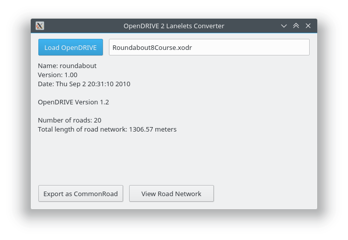

# OpenDRIVE 2 Lanelet - Converter

We provide the code for an OpenDRIVE ([www.opendrive.org](http://www.opendrive.org)) to lanelets ([www.mrt.kit.edu/software/liblanelet](https://www.mrt.kit.edu/software/libLanelet/libLanelet.html)) converter, which has been introduced in our [paper](https://mediatum.ub.tum.de/doc/1449005/1449005.pdf): M. Althoff, S. Urban, and M. Koschi, "Automatic Conversion of Road Networks from OpenDRIVE to Lanelets," in Proc. of the IEEE International Conference on Service Operations and Logistics, and Informatics, 2018.

[](https://opendrive2lanelet.readthedocs.io/en/latest/?badge=latest)
[](https://badge.fury.io/py/opendrive2lanelet)
[](https://pypi.org/project/opendrive2lanelet/)
[](https://www.gnu.org/licenses/gpl-3.0.de.html)

## Installation

### Installing from source

```bash
git clone https://gitlab.lrz.de/cps/opendrive2lanelet.git
cd opendrive2lanelet
python setup.py install
```

Public source (only released versions): https://gitlab.lrz.de/tum-cps/opendrive2lanelet.git


### Using pip:

```bash
pip install opendrive2lanelet
```

Optionally, for using the gui packages:

```bash
pip install opendrive2lanelet[GUI]
```

## Example OpenDRIVE Files

Download example files from: http://opendrive.org/download.html

## Usage

### Using our provided GUI

Start the GUI with ```opendrive2lanelet-gui```



### Converting a file with the command line

Execute ```opendrive2lanelet-convert input_file.xodr -o output_file.xml```

If you want to visualize the Commonroad file, use the ```opendrive2lanelet-visualize``` command.

### Using the library in your own scripts

```python
from lxml import etree
from opendrive2lanelet.opendriveparser.parser import parse_opendrive
from opendrive2lanelet.network import Network
from from commonroad.common.file_writer import CommonRoadFileWriter

# Import, parse and convert OpenDRIVE file
with open("{}/opendrive-1.xodr".format(os.path.dirname(os.path.realpath(__file__))), "r") as fi:
	open_drive = parse_opendrive(etree.parse(fi).getroot())

road_network = Network()
road_network.load_opendrive(open_drive)

scenario = road_network.export_commonroad_scenario()
# Write CommonRoad scenario to file
from commonroad.common.file_writer import CommonRoadFileWriter
commonroad_writer = CommonRoadFileWriter(
            scenario=scenario,
            planning_problem_set=None,
            author="",
            affiliation="",
            source="OpenDRIVE 2 Lanelet Converter",
            tags="",
        )
with open("{}/opendrive-1.xml".format(os.path.dirname(os.path.realpath(__file__))), "w") as fh:
	commonroad_writer.write_scenario_to_file_io(file_io=fh)
```

### Just parsing the OpenDrive .xodr file
```python
from lxml import etree
from opendrive2lanelet.opendriveparser.parser import parse_opendrive

with open("input_opendrive.xodr", 'r') as fh:
	open_drive = parse_opendrive(etree.parse(fh).getroot())

# Now do stuff with the data
for road in open_drive.roads:
	print("Road ID: {}".format(road.id))
```

## Documentation

The documentation is published on [Read the Docs](https://opendrive2lanelet.readthedocs.io/en/latest/).


To generate the documentation from source, first install the necessary dependencies with pip:
```bash
pip install -r docs_requirements.txt
```

Then you can run
```bash
cd docs && make html
```
for example.


## Known Problems

- When trying to use the gui.py under Wayland, the following error occurs:
  ```
  This application failed to start because it could not find or load the Qt platform plugin "wayland" in "".
  Available platform plugins are: eglfs, linuxfb, minimal, minimalegl, offscreen, vnc, xcb.
  Reinstalling the application may fix this problem.
  ```
  Set the platform to *xcb* using this command: ```export QT_QPA_PLATFORM="xcb"```

## Authors

Sebastian Maierhofer (current maintainer) 
Benjamin Orthen  
Stefan Urban
