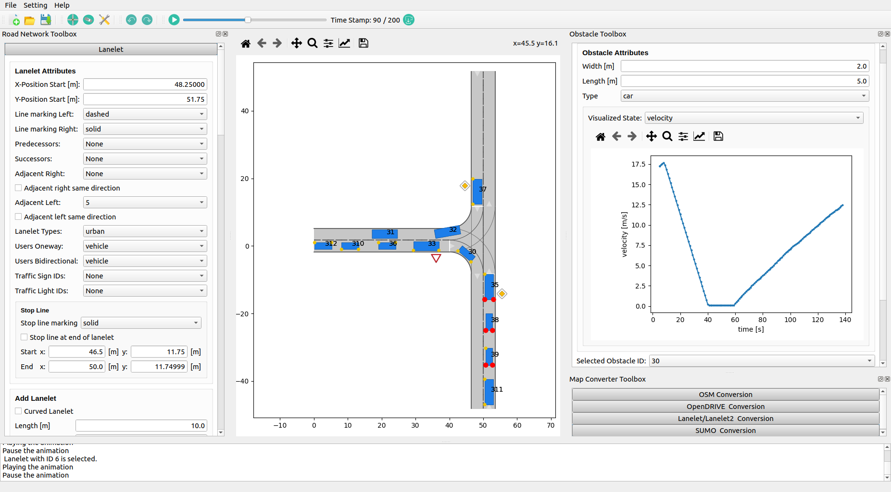

# CommonRoad Scenario Designer
[](https://pypi.python.org/pypi/commonroad-scenario-designer/)  
[](https://pypi.python.org/pypi/commonroad-scenario-designer/)
[](https://pypi.python.org/pypi/commonroad-scenario-designer/) 
[](https://pypi.python.org/pypi/commonroad-scenario-designer/)  
[](https://pypi.python.org/pypi/commonroad-scenario-designer/)

This toolbox provides map converters for [OpenStreetMap](https://www.openstreetmap.de/karte.html) (OSM), 
[Lanelet](https://www.mrt.kit.edu/software/libLanelet/libLanelet.html) / [Lanelet2](https://github.com/fzi-forschungszentrum-informatik/Lanelet2), 
[OpenDRIVE](https://www.asam.net/standards/detail/opendrive/), and [SUMO](https://sumo.dlr.de/docs/index.html) to the [CommonRoad](https://commonroad.in.tum.de/) 
(CR) format and for some formats vice versa.  
Additionally, a graphical user interface (GUI) is included, which allows one to efficiently create and manipulate 
CommonRoad maps and scenarios.

|  Tool                               |                 Path                  |                                Functionality                                 |
| :---------------------------------: |:-------------------------------------:|:----------------------------------------------------------------------------:|
|OpenDRIVE => CR            | `crdesigner/map_converter/opendrive`  |                   Conversion from OpenDRIVE to CommonRoad.                   |
|Lanelet/Lanelet2 <=> CR |  `crdesigner/map_converter/lanelet2`  | Conversion from Lanelet2 to CommonRoad <br /> and from CommonRoad to Lanelet |
|OSM => CR                  |   `crdesigner/map_converter/osm2cr`   |                      Conversion from OSM to CommonRoad.                      |
|SUMO <=> CR             |  `crdesigner/map_converter/sumo_map`  |              Conversion from SUMO to CommonRoad and vice versa.              |
|CR Scenario Designer GUI             |     `crdesigner/input_output/gui`     |    Multi-functional GUI for map conversion and scenario creation/editing.    |

## Prerequisites and Installation
We have tested the toolbox with Python 3.8, 3.9, 3.10, and 3.11.
The toolbox should work under Linux, macOS, and Windows. 
Below we present two ways of installing the CommonRoad Scenario Designer: 
- Only using the CommonRoad Scenario Designer, e.g.,the GUI or integrating the scenario designer APIs into your code
- Developing code for the CommonRoad Scenario Designer

If you want to use the SUMO conversion or to generate traffic using SUMO, please install 
[SUMO](https://sumo.dlr.de/docs/index.html):
```bash
sudo apt-get update
sudo apt-get install sumo sumo-tools sumo-doc
echo "export SUMO_HOME=/usr/share/sumo" >> ~/.bashrc
echo 'export PYTHONPATH="$SUMO_HOME/tools:$PYTHONPATH"' >> ~/.bashrc
```
If you use zsh, replace `.bashrc` with `.zshrc`.

### Using the CommonRoad Scenario Designer
The recommended way of installation if you only want to use the scenario designer (i.e., you do not want to work with the code directly) is to use the PyPI package:
```bash
pip install commonroad-scenario-designer
```

### Development
First, clone the repository.
The usage of [Poetry](https://python-poetry.org/) is recommended. 
Poetry can be installed using:
```bash
curl -sSL https://install.python-poetry.org | python3 -
```
Create a new Python environment:
```bash
poetry shell
poetry install --with tests,docs,tutorials
```
We recommend to use PyCharm (Professional) as IDE.

### Common Errors during installation

#### Ubuntu 
- **Could not load the Qt platform plugin “xcb” in “” even though it was found:** Error seems to be a missing package - either libxkbcommon-x11 or libxcb-xinerama0 (both can be installed by ```sudo apt install [package_name]```). See for reference [here](https://discuss.pixls.us/t/solved-could-not-load-the-qt-platform-plugin-xcb-in-even-though-it-was-found/17677/9)


## Usage
We provide different types of usage for the _CommonRoad Scenario Designer_. Subsequently, we present for each component 
the different usage methods.

### GUI



Within the GUI, you can also execute the different converters.
The GUI can either be activated via a Python API, command line, or executing a Python script.

#### Python Script

First you need to activate your python environment with the installed dependencies.  
Afterward, you can start the _CommonRoad Scenario Designer_ and the GUI will open:

```bash
$ python crdesigner/start_gui.py
```

#### Command Line
The GUI can be started from command line via the following two options:
```bash
$ crdesigner
$ crdesigner gui
```
Note that you have to activate first the Python environment in which the CommonRoad Scenario Designer is installed.

### Map Converters
You can execute the different converters either via command line, calling them within your Python program via an API, 
or the GUI.

#### API
The main APIs to execute the pure conversions are located under `crdesigner/map_conversion/map_conversion_interface.py`.   
For many conversions we provide further APIs, e.g., for downloading a map from OSM.

#### Command Line
Note that you have to activate first the Python environment in which the CommonRoad Scenario Designer was installed.  
Converting a file from OpenDRIVE to CommonRoad with the command line:
```bash
crdesigner [mode] -i [input_file] -o [output_file] -c -f -t [tags] --proj [proj-string] --adjacencies --left-driving --author --affiliation
```
For a description of the command line arguments please execute 
```bash
crdesigner -h
```

#### GUI
The GUI provides a toolbox with which contains functionality to load maps given in formats other the CommonRoad format   
and to convert CommonRoad maps to other formats or the other formats to the CommonRoad format.

#### Important information

When converting OSM maps, missing information such as the course of individual lanes is estimated during the process.  
These estimations are imperfect (the OSM maps as well) and often it is advisable to edit the 
scenarios by hand via the GUI.

#### Tutorials
We also provide tutorials demonstrating how the different map converter APIs can be used.  
The tutorials include a jupyter notebook and exemplary Python scripts for each conversion.

## Documentation
To generate the documentation from source, first install the necessary dependencies with pip:

```bash
cd docs/source && sphinx-build -b html . ../../public
```

The documentation can be accessed by opening `public/index.html`.  
The titles of module pages have to be set manually!  
The full documentation of the API and introducing examples can also be found [here](https://commonroad-scenario-designer.readthedocs.io/en/latest/).

## Changelog
A detailed overview about the changes in each version is provided in the [Changelog](https://gitlab.lrz.de/tum-cps/commonroad-scenario-designer/-/blob/main/CHANGELOG.md).

## Bug and feature reporting
This release (v0.7.1) is still a BETA version.  
In case you detect a bug or you want to suggest a new feature, please report it in our [forum](https://commonroad.in.tum.de/forum/c/scenario-designer/18).   
If you want to contribute to the toolbox, you can also post it in the [forum](https://commonroad.in.tum.de/forum/c/scenario-designer/18) or contact [Sebastian Maierhofer](sebastian.maierhofer@tum.de).

## Authors
Responsible: Sebastian Maierhofer, Sebastian Mair  
Contribution (in alphabetic order by last name): Daniel Asch, Hamza Begic, Mohamed Bouhali, Florian Braunmiller, 
Tim Dang, Behtarin Ferdousi, Maximilian Fruehauf, Marcus Gabler, Fabian Hoeltke, Tom Irion, Aaron Kaefer, Anton Kluge, 
David Le, Gustaf Lindgren, Sarra Ben Mohamed, Benjamin Orthen, Luisa Ortner, Louis Pröbstle, Benedikt Reinhard, 
Maximilian Rieger, Til Stotz, Stefan Urban, Max Winklhofer

## Credits
We gratefully acknowledge partial financial support by
- DFG (German Research Fundation) Priority Program SPP 1835 Cooperative Interacting Automobiles
- BMW Group within the Car@TUM project
- Central Innovation Programme of the German Federal Government under grant no. ZF4086007BZ8

## Citation
**If you use our code for research, please consider to cite our paper:**
```
@inproceedings{Maierhofer2021,
	author = {Sebastian Maierhofer, Moritz Klischat, and Matthias Althoff},
	title = {CommonRoad Scenario Designer: An Open-Source Toolbox for Map Conversion and Scenario Creation for Autonomous Vehicles},
	booktitle = {Proc. of the IEEE Int. Conf. on Intelligent Transportation Systems },
	year = {2021},
	abstract = {Maps are essential for testing autonomous driving functions. Several map and scenario formats are 
                    available. However, they are usually not compatible with each other, limiting their usability.  
                    In this paper, we address this problem using our open-source toolbox that provides map converters  
                    from different formats to the well-known CommonRoad format. Our toolbox provides converters for 
                    OpenStreetMap, Lanelet/Lanelet2, OpenDRIVE, and SUMO. Additionally, a graphical user interface is 
                    included, which allows one to efficiently create and manipulate CommonRoad maps and scenarios. 
                    We demonstrate the functionality of the toolbox by creating CommonRoad maps and scenarios based on 
                    other map formats and manually-created map data.},
}
```
**If you use the OpenDRIVE to CommonRoad conversion for your paper, please consider to additionally cite the corresponding paper:**
```
@inproceedings{Althoff2018b,
	author = {Matthias Althoff and Stefan Urban and Markus Koschi},
	title = {Automatic Conversion of Road Networks from OpenDRIVE to Lanelets},
	booktitle = {Proc. of the IEEE International Conference on Service Operations and Logistics, and Informatics},
	year = {2018},
	abstract = {Detailed road maps are an important building block for autonomous driving. They accelerate creating a 
	            semantic environment model within the vehicle and serve as a backup solution when sensors are occluded 
	            or otherwise impaired. Due to the required detail of maps for autonomous driving and virtual test 
	            drives, creating such maps is quite labor-intensive. While some detailed maps for fairly large regions 
	            already exist, they are often in different formats and thus cannot be exchanged between companies and 
	            research institutions. To address this problem, we present the first publicly available converter from
	            the OpenDRIVE format to lanelets—both representations are among the most popular map formats. 
	            We demonstrate the capabilities of the converter by using publicly available maps.},
}
```