When does the automated conversion work?
========================================

This tool was originally created to automatically convert OSM files to CommonRoad scenarios.
Unfortunately, the tool is not capable to convert all kinds scenarios.
This is because of the fundamental difference of the two formats.
OSM only describes the rough course of a street while CR depicts the boundaries of each drivable lane.
Especially the representation of intersections differs, as they are only points in OSM, while CR files contain all
lanes, connecting the streets across the intersection.
The missing information is generated by the tool following many heuristics and modifiable parameters.
In many cases it is necessary to adjust these parameters or guide the tool by hand instead of relying on the heuristics.

Please be always aware, that the automated tool generates only realistic scenarios, which do not fit reality perfectly.
**Do not use them as maps for autonomous vehicles if you did not review them by hand!**

Scenarios That Will Work Well
-----------------------------
There are many scenarios for which the automated conversion will perform well.
For example motorways and highways, which do not have complicated intersections will be converted quite reliably.
Roads with few lanes, low curvature and far apart intersections, such as parking lots,
will also be converted correctly most times.

A few positive examples can be seen in the following:

.. image::
 images/satellite_1.png
 :width: 500

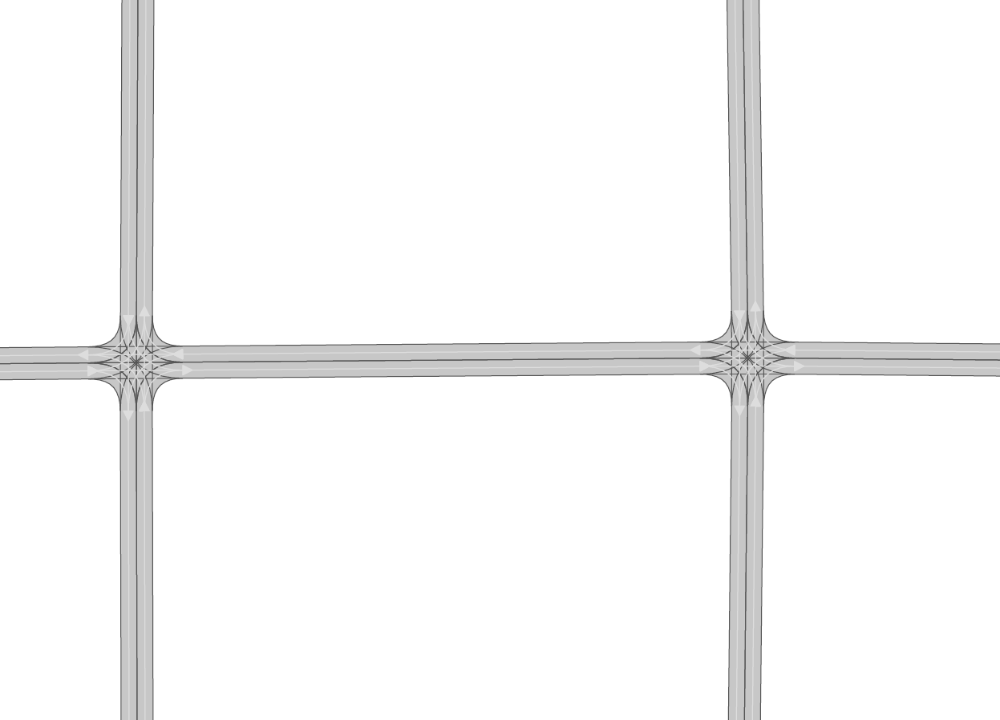

Simple straight roads intersecting.

.. image::
 images/satellite_2.png
 :width: 500

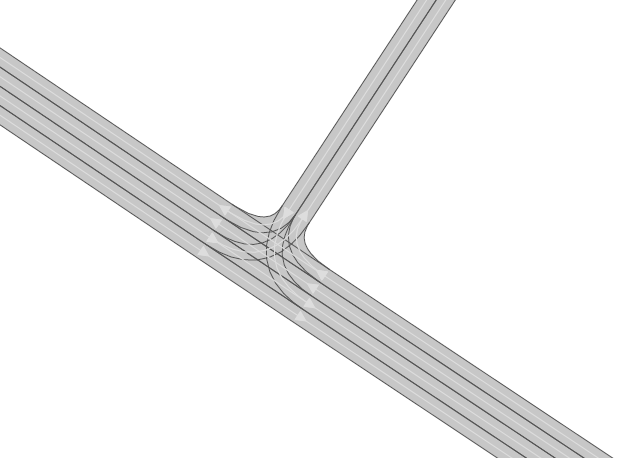

A larger intersection with many lanes.

.. image::
 images/satellite_3.png
 :width: 500

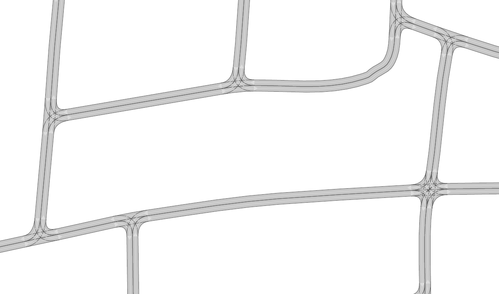

An example for a small town.

.. image::
 images/satellite_4.png
 :width: 500

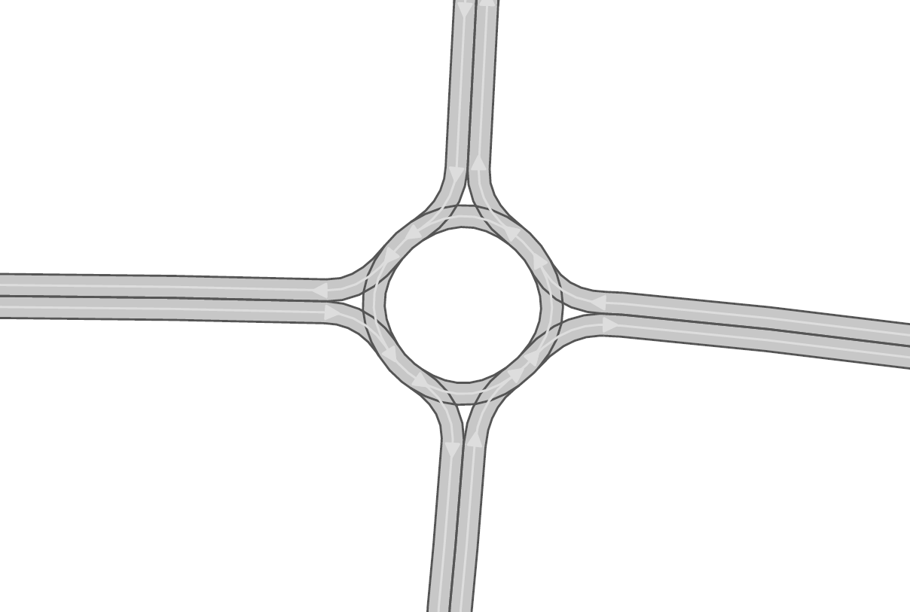

A simple roundabout.

.. image::
 images/motorway_sat.png
 :width: 500

.. image::
 images/motorway.png
 :width: 500

A large motorway intersection.

.. image::
 images/motorway_2_sat.png
 :width: 500

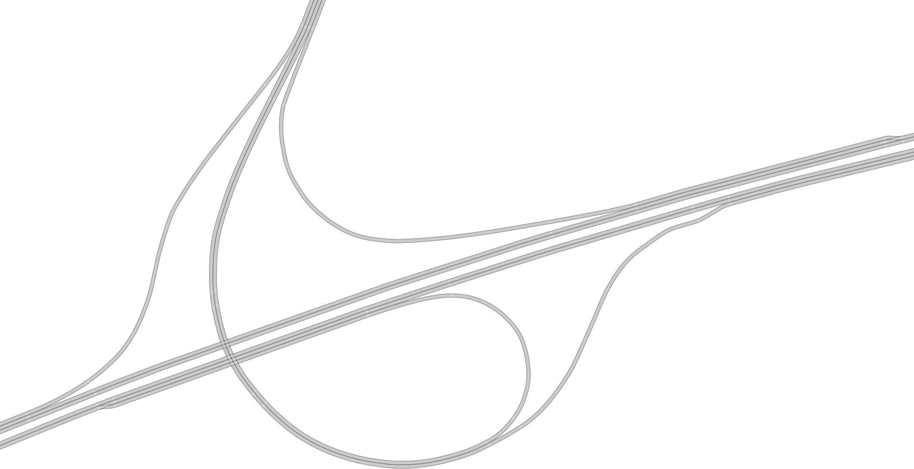

A motorway access.

Problematic Scenarios
---------------------
The conversion process can fail because of various reasons.
Problematic occurrences we experienced repeatedly are listed in the following.

Faulty OSM Data
~~~~~~~~~~~~~~~
Relying on solely OSM data for the generation of a scenario causes the tool to be extremely prone to incomplete and
faulty OSM data.
This seems obvious, but it is easy to overlook small flaws that will cause the result to be surprisingly erroneous.
For example, it occurs frequently, that small segments of roads do not have lane count information.
This causes the result to have a different count of lanes for these small segments as visible in the following example:

.. image::
 images/munich_20_sat.png
 :width: 500

.. image::
 images/munich_20_osm.png
 :width: 500

OSM file

.. image::
 images/munich_20_result.png
 :width: 500

CR result

To overcome this issue, it will be easiest to correct the OSM data, for example with the tool
`JOSM <https://josm.openstreetmap.de/>`_.
If the info about lane counts is just missing and not wrong, you can also edit the **LANECOUNTS** Parameter in
**config.py**, to lead the tool to choose the correct count by default.
See more under :doc:`Parameters <../config>`

Large Intersections
~~~~~~~~~~~~~~~~~~~
Linking lanes across intersections in a reasonable manner becomes exponentially more difficult for intersections of
many streets.
We therefore did only build detailed heuristics for intersections with up to four streets (segments of roads that lead
to the intersection) involved.
For larger intersection, there is a fallback heuristic, which might work well if all streets have only one lane per
direction but will most likely produce insufficient results otherwise.

Example:

.. image::
 images/large_intersection_sat.png
 :width: 500

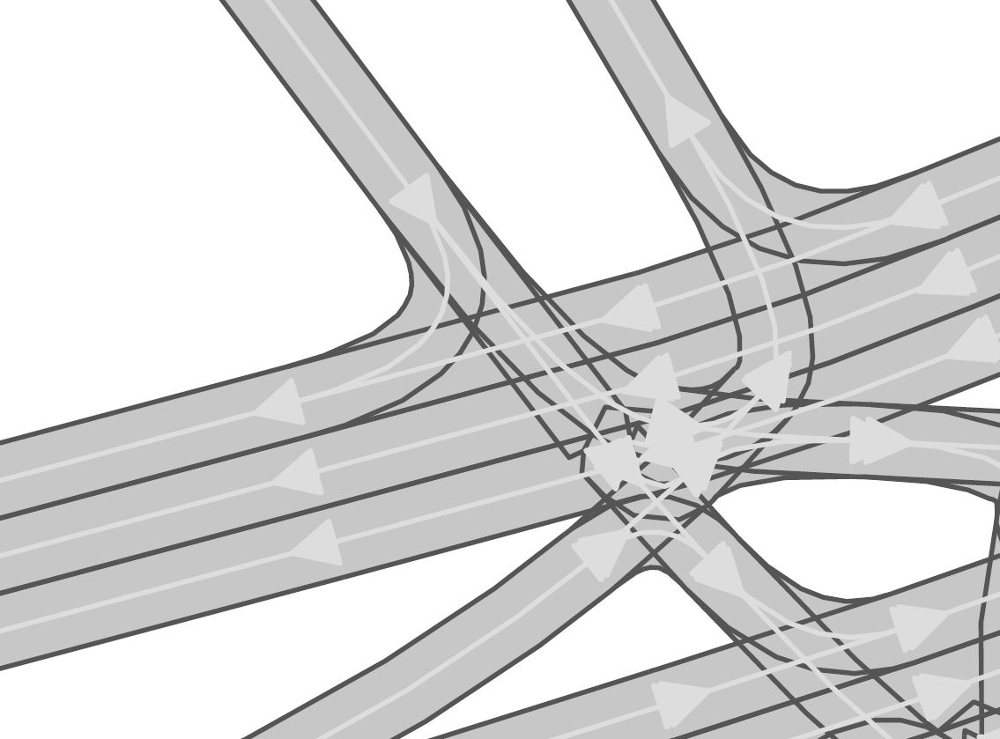

The linking of lanes across intersections can be guided by hand in the GUI of this tool.
See Lane Link Edit in :doc:`the GUI guide <../gui_guide>` for further description.

Narrow Winding Streets
~~~~~~~~~~~~~~~~~~~~~~
The tool creates the course of lanes by offsetting the central course of roads.
This offsetting procedure will not work well for wide roads with tight curves.

Example:

.. image::
 images/garching_27_sat.png
 :width: 500

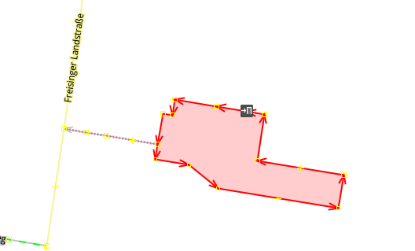

OSM file

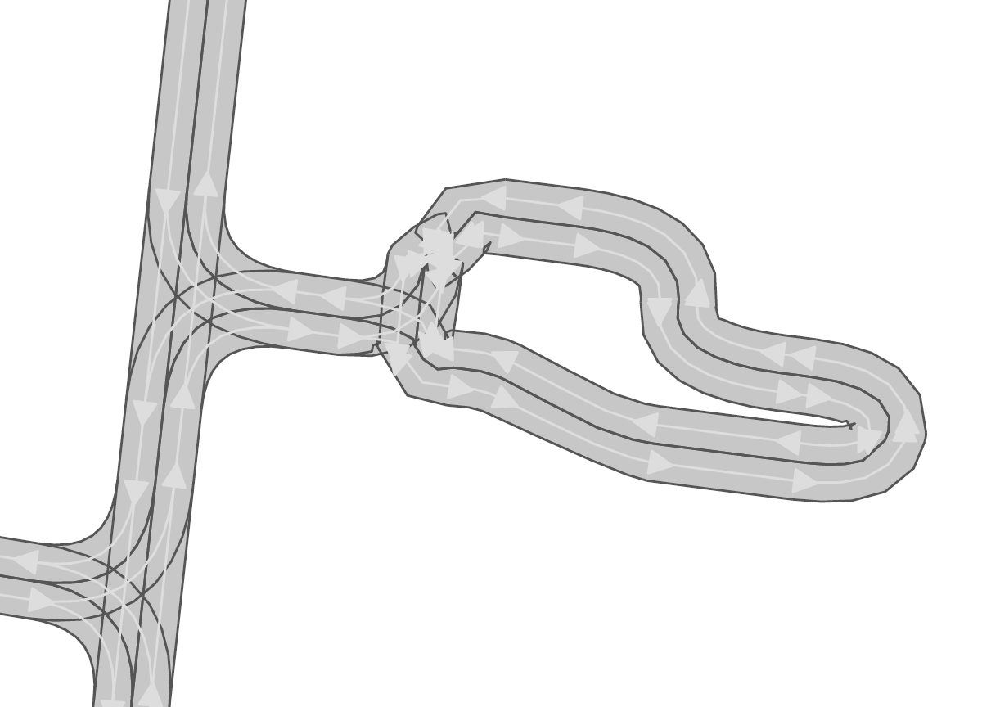

CR result

This problem occurs rarely and usually only concerns very small streets, for example the driveways of an underground
car park.
If you nonetheless need to depict such streets in CR, you can try to model the course accurately in the
**Edge Edit GUI**.
See :doc:`the GUI guide <../gui_guide>` for further description.

Streets Running Close Together
~~~~~~~~~~~~~~~~~~~~~~~~~~~~~~

Streets are cropped at intersections to leave space for the turning lanes on the intersection.
By default, they are cropped until they have at least a certain distance to all other streets.
When two roads are running closely together, it can happen that both of them are cropped far wider than necessary.
This results in oddly long turning lanes.

Example:

.. image::
 images/biberach_69_sat.png
 :width: 500

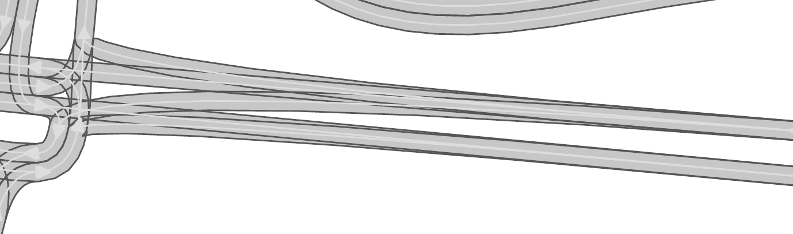

If you encounter this problem, try to set the parameter **INTERSECTION_CROPPING_WITH_RESPECT_TO_ROADS** in **config.py**
to **False**.
Then the tool will crop roads until a certain distance to the center of the intersection.

Very Complicated Scenarios
~~~~~~~~~~~~~~~~~~~~~~~~~~

There are several factors, which can make a scenario complicated.
We see most problems when there are many large intersections (containing many lanes/streets) close together.
In such cases many things can go wrong.

Example:

.. image::
 images/sao_paulo_6_sat.png
 :width: 500

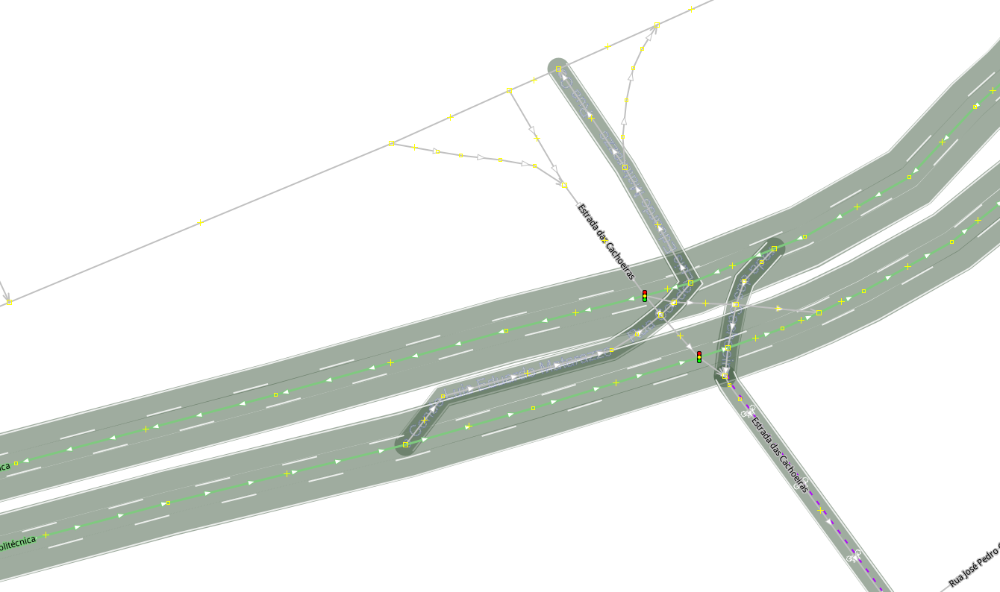

OSM file

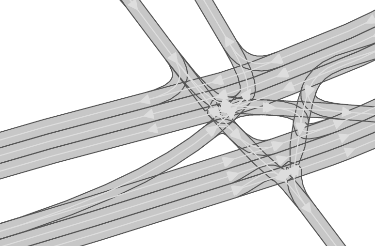

CR result

We advice to use the GUI for such scenarios and pay close attention to every street segment.
If you are doing that, it is also helpful to set the parameter **DELETE_SHORT_EDGES** in **config.py**
to **False**.
This will prevent the tool from deleting road segments it considers as too short, as they can be reviewed in the GUI.
In some cases it might still be necessary, to create at least parts of the scenario by hand.

Left Hand Traffic
~~~~~~~~~~~~~~~~~

The tool assumes right hand traffic for all scenarios.
