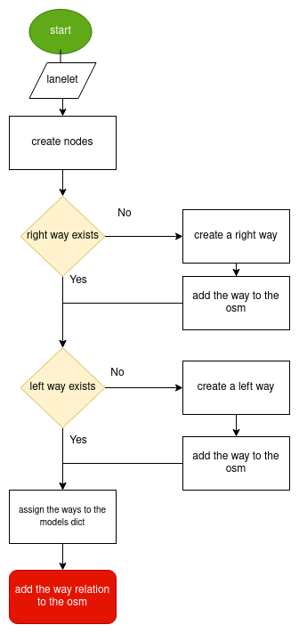

# CommonRoad to Lanelet2
This conversion allows you to convert a road network description from
[CommonRoad (Version 2020a) format](https://gitlab.lrz.de/tum-cps/commonroad-scenarios/blob/master/documentation/XML_commonRoad_2020a.pdf)
to the
[Lanelet2 format](https://github.com/fzi-forschungszentrum-informatik/Lanelet2).

## Usage

The CommonRoad to Lanelet2 conversion can be used via
- command line interface
- GUI
- Python API

For the relevant GUI commands execute
``crdesigner --help``.
Tutorials on how to use the Python APIs can be found in our
[GitHub repository](https://github.com/CommonRoad/commonroad-scenario-designer/tree/develop/tutorials/conversion_examples).

## Implementation Details

Converting back from cartesian to geographic coordinates requires, like mentioned in the above description of the
reverse conversion, a projection.

This code of this conversion take some points into account:

- If a lanelet has a successor, the converted nodes at the end of the lanelet have to be the same as the nodes of the converted successor.
- Same lanelet predecessor relationships.
- If a lanelet is adjacent to another lanelet, and the vertices of the shared border coincide, they can share a way in the converted OSM document.

To get a better understanding of the conversion process, a flowchart of the function that transforms the lanelet
(CommonRoad format) to the WayRelation (Lanelet2/OSM format) is given below:

The function takes a lanelet as an input and creates nodes based on those lanelet's vertices.
As the nodes form right and left ways, the function checks if those ways already exist.
If not, the function creates those ways, maps them to the way relation, and assigns them to the osm object's dictionary.
If the way already exists, there is no need to create it, as the function maps the same id as of the newly
found way to the way relation in the previously mentioned dictionary.
