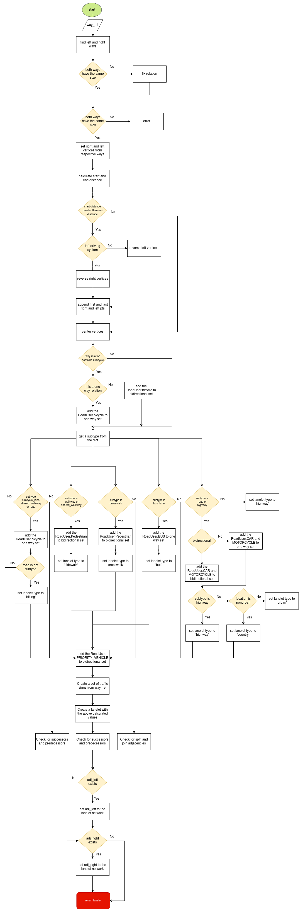

# Lanelet2 to CommonRoad
This conversion allows you to convert a road network description from
[Lanelet2 format](https://github.com/fzi-forschungszentrum-informatik/Lanelet2)
to the
[CommonRoad (Version 2020a) format](https://gitlab.lrz.de/tum-cps/commonroad-scenarios/blob/master/documentation/XML_commonRoad_2020a.pdf).

## Usage
The CommonRoad to Lanelet2 conversion can be used via

- command line interface
- GUI
- Python API

For the relevant GUI commands execute
``crdesigner --help``.
Tutorials on how to use the Python APIs can be found in our
[GitHub repository](https://github.com/CommonRoad/commonroad-scenario-designer/tree/develop/tutorials/conversion_examples).

### Implementation Details

As OSM lanelet boundaries are saved as geographic coordinates (lat, lon) and CommonRoad saves the
boundaries as cartesian (map projection) coordinates, a projection is needed for the conversion.
This projection is provided as a proj-string, as defined by the PROJ library (https://proj.org/index.html).
A proj-strings holds the parameters of a given coordinate transformation.

This project uses pyproj (https://pypi.org/project/pyproj/) which is a Python interface to the PROJ library.
The default proj-string defined here is "+proj=utm +zone=32 +ellps=WGS84", which describes
a Universal Transversal Mercator projection.

A few comments on the conversion:

- A lanelet and its successor share two nodes (last ones of the lanelet, first ones of the successor).
- Therefore, to detect this relation and save it in the CommonRoad file,
dictionaries are used which save the node-lanelet relation, e.g.,
"Node is first left node of which lanelet" (first_left_nodes[node_id] = lanelet_id).
- Same for lanelet predecessor relationship.
- If lanelets in OSM share a common way, they are adjacent to each other.
As a way can have only one direction, and if it is shared by lanelets having opposite driving directions,
the vertices of one boundary of one of the two lanelet have to be reversed after conversion.
This boundary is by default the left boundary considering the right-driving system in most of the world.
You can set it to right by using the argument "left_driving_system=True" when calling the Converter.
- Lanelets can be adjacent without sharing a common way, because two ways can describe the same trajectory,
but with a different number of nodes.
This converter can still compare two vertices which resulted from converting two possible adjacent ways
to the CommonRoad lanelet format and determine if the corresponding lanelets are adjacent.
However, this is computationally quite intensive and is thus disabled by
default (enable it with "--adjacencies" in the command line tool or setting "detect_adjacencies=True"
when calling the converter.)

To get a better understanding of the conversion process, a flowchart of the function that
transforms the WayRelation (Lanelet2/OSM format) to the Lanelet (CommonRoad format) is given below:

Both left and right ways of the WayRelation object have to be of the same size.
If not, the function tries to fix the issue by resizing one of the ways, raising an error in case of a failure.
If there is no failure, the function creates left and right vertices from those respective ways.
Potentially, it reverses them, depending on the driving system and the location of the start and the end points of those
newly created vertices.
Special meanings of the WayRelation, such as the road user, direction or the road type are extracted and stored as
lanelet's attributes.
A set of traffic signs, from the WayRelation object, is created, after which the function checks for
potentially already existing successor and predecessor lanelets.
