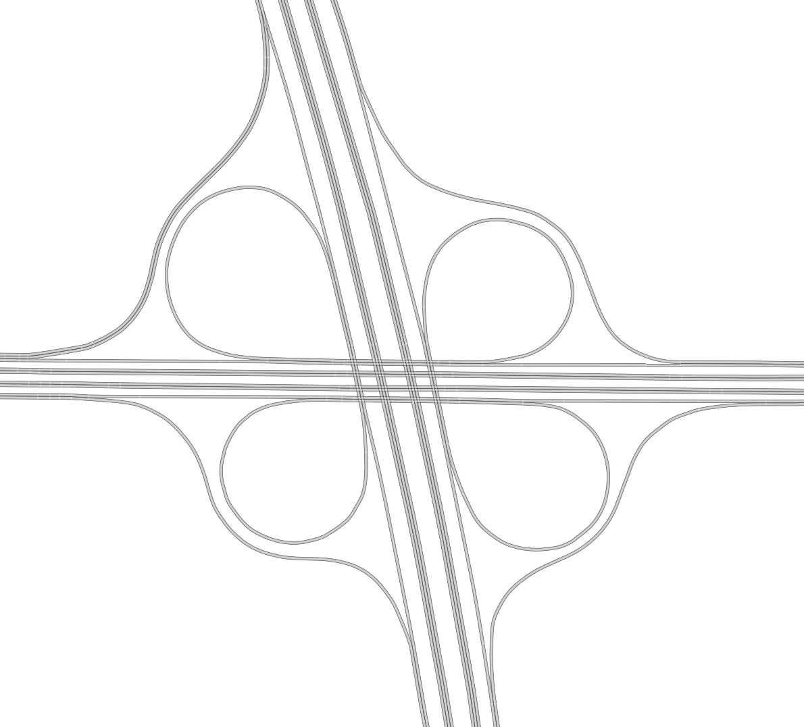
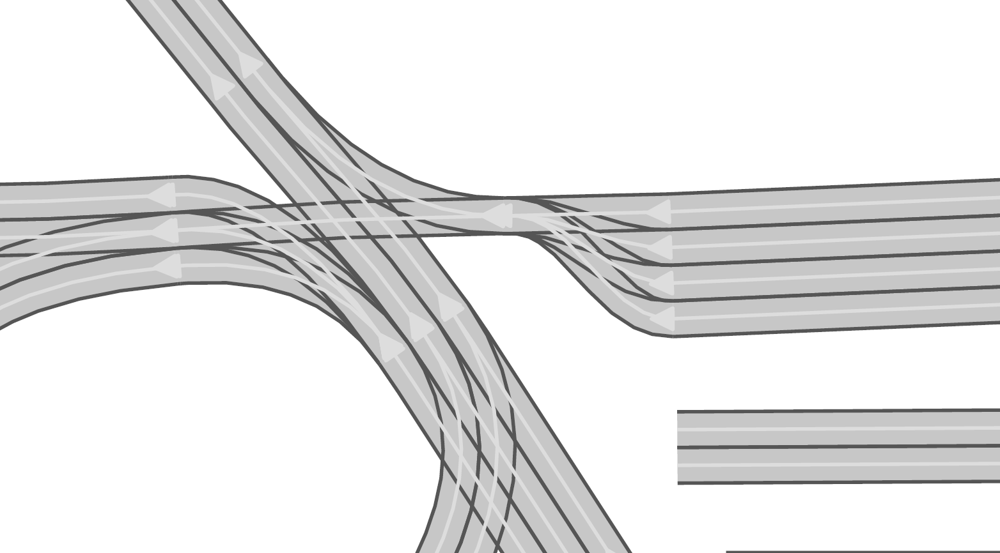
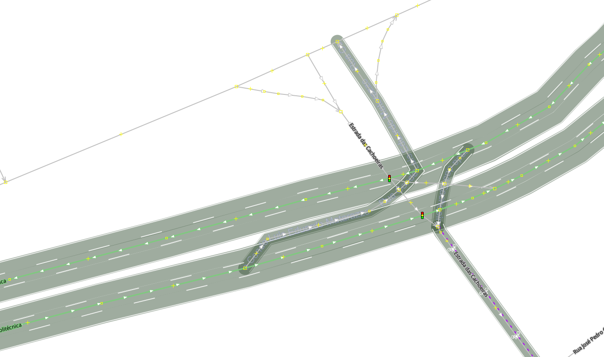

.. 
  Normally, there are no heading levels assigned to certain characters as the structure is
  determined from the succession of headings. However, this convention is used in Python’s
  Style Guide for documenting which you may follow:

  # with overline, for parts
  * for chapters
  = for sections
  - for subsections
  ^ for subsubsections
  " for paragraphs

Open Street Maps (OSM) to CommonRoad Conversion
###############################################

Quick Start Guide
*****************

To run this Tool, please make sure, you have installed all dependencies:

 * cartopy		
 * matplotlib
 * mercantile
 * numpy
 * pillow
 * scipy
 * utm
 * commonroad-io

If you want to use aerial images in the GUI you also need to get a
`Bing Maps key <https://docs.microsoft.com/en-us/bingmaps/getting-started/bing-maps-dev-center-help/getting-a-bing-maps-key>`_
and insert it in **config.py**.

To start a conversion with osm_2_cr run **main.py** with either of the following arguments:

* **o** **filename** to open a osm file and convert it
* **d** to download a area specified in **config.py**
* **g** to open the gui

Valid calls would for example be::

    $ python main.py o map.osm

Or::

    $ pyton main.py d

Or::

    $ python main.py g

A further description is given in this `Example <usage/example>`.

Implementation
**************

You can find a possiblity to use the methods of this package without **main.py** in the **Usage Example**.
A description of the capabilities of the automated conversion is given in **When does the automated conversion work?**.
**How to use the GUI** is a guide for the GUI.
The documentation of the converter module providing the main functionality can be found in **The Converter Module**.
A description of all parameters is provided in **Parameters**.
The full documentation of the package is visible in **converter package**.

System Design
=============

Format differences
------------------

OpenStreetMap (OSM) files and CommonRoad (CR) scenarios are formats that can both represent road networks with additional elements. While they both use XML to be stored on disk the internal structure has many differences. 
We will only look at the ones important for the conversion.

Firstly the road network in OSM is basically a graph with nodes and edges. One edge represents a road. Compared to CR here we have lanelets and information about intersections.
The coordinates (GPS) in OSM are rough and the amount of points per road section is much smaller.
To accomplish the conversion we have to use heuristics and interpolation for guessing the reality behind the data.

OSM also contains other elements like traffic signs. All this information is stored in so called tags or relations. With the latest version of CR (2020.2) new elements are inserted into the scenario format: Traffic Signs and Traffic Lights.

Conversion Overview
-------------------

Extremely simplified the conversion process works as follows:

.. image::
 images/OSM_control_flow.png
 :width: 500

The program takes a OSM file as input and parses it into the internel representation (graph). The refine the coordinate the user can adjust the graph with the GUI tool **EdgeEdit**. 

Afterwards the each edge that is representing a road with multiple lanes is split into these lane so that there is exactely one edge per lane. As intersection are only single points in OSM the lanes are cut of with a specific radius around the intersection and linked together again. This linking can be adjusted with the GUI tool **LaneLinkEdit**. 

Detailed Conversion
-------------------

Please refer to the Bachelor's thesis of Maximilian Rieger at **doc/pdf/thesis_osm2cr.pdf**.

When does the automated conversion work?
========================================

This tool was originally created to automatically convert OSM files to CommonRoad scenarios.
Unfortunately, the tool is not capable to convert all kinds scenarios.
This is because of the fundamental difference of the two formats.
OSM only describes the rough course of a street while CR depicts the boundaries of each drivable lane.
Especially the representation of intersections differs, as they are only points in OSM, while CR files contain all
lanes, connecting the streets across the intersection.
The missing information is generated by the tool following many heuristics and modifiable parameters.
In many cases it is necessary to adjust these parameters or guide the tool by hand instead of relying on the heuristics.

Please be always aware, that the automated tool generates only realistic scenarios, which do not fit reality perfectly.
**Do not use them as maps for autonomous vehicles if you did not review them by hand!**

Scenarios That Will Work Well
-----------------------------
There are many scenarios for which the automated conversion will perform well.
For example motorways and highways, which do not have complicated intersections will be converted quite reliably.
Roads with few lanes, low curvature and far apart intersections, such as parking lots,
will also be converted correctly most times.

A few positive examples can be seen in the following:

.. image::
 images/positive_1.png
 :width: 500

Simple straight roads intersecting.

.. image::
 images/positive_2.png
 :width: 500

A larger intersection with many lanes.

.. image::
 images/positive_3.png
 :width: 500

An example for a small town.

.. image::
 images/positive_4.png
 :width: 500

A simple roundabout.

A large motorway intersection.

.. image::
 images/motorway_2.png
 :width: 500

A motorway access.

Problematic Scenarios
---------------------
The conversion process can fail because of various reasons.
Problematic occurrences we experienced repeatedly are listed in the following.

Faulty OSM Data
~~~~~~~~~~~~~~~
Relying on solely OSM data for the generation of a scenario causes the tool to be extremely prone to incomplete and
faulty OSM data.
This seems obvious, but it is easy to overlook small flaws that will cause the result to be surprisingly erroneous.
For example, it occurs frequently, that small segments of roads do not have lane count information.
This causes the result to have a different count of lanes for these small segments as visible in the following example:

.. image::
 images/munich_20_osm.png
 :width: 500

OSM file

CR result

To overcome this issue, it will be easiest to correct the OSM data, for example with the tool
`JOSM <https://josm.openstreetmap.de/>`_.
If the info about lane counts is just missing and not wrong, you can also edit the **LANECOUNTS** Parameter in
**config.py**, to lead the tool to choose the correct count by default.
See more under :doc:`Parameters <../config>`

Large Intersections
~~~~~~~~~~~~~~~~~~~
Linking lanes across intersections in a reasonable manner becomes exponentially more difficult for intersections of
many streets.
We therefore did only build detailed heuristics for intersections with up to four streets (segments of roads that lead
to the intersection) involved.
For larger intersection, there is a fallback heuristic, which might work well if all streets have only one lane per
direction but will most likely produce insufficient results otherwise.

Example:

.. image::
 images/large_intersection.png
 :width: 500

The linking of lanes across intersections can be guided by hand in the GUI of this tool.
See Lane Link Edit in :doc:`the GUI guide <../gui_guide>` for further description.

Narrow Winding Streets
~~~~~~~~~~~~~~~~~~~~~~
The tool creates the course of lanes by offsetting the central course of roads.
This offsetting procedure will not work well for wide roads with tight curves.

Example:

.. image::
 images/garching_27_osm.png
 :width: 500

OSM file

.. image::
 images/garching_27_result.png
 :width: 500

CR result

This problem occurs rarely and usually only concerns very small streets, for example the driveways of an underground
car park.
If you nonetheless need to depict such streets in CR, you can try to model the course accurately in the
**Edge Edit GUI**.
See :doc:`the GUI guide <../gui_guide>` for further description.

Streets Running Close Together
~~~~~~~~~~~~~~~~~~~~~~~~~~~~~~

Streets are cropped at intersections to leave space for the turning lanes on the intersection.
By default, they are cropped until they have at least a certain distance to all other streets.
When two roads are running closely together, it can happen that both of them are cropped far wider than necessary.
This results in oddly long turning lanes.

Example:

.. image::
 images/close_roads.png
 :width: 500

If you encounter this problem, try to set the parameter **INTERSECTION_CROPPING_WITH_RESPECT_TO_ROADS** in **config.py**
to **False**.
Then the tool will crop roads until a certain distance to the center of the intersection.

Very Complicated Scenarios
~~~~~~~~~~~~~~~~~~~~~~~~~~

There are several factors, which can make a scenario complicated.
We see most problems when there are many large intersections (containing many lanes/streets) close together.
In such cases many things can go wrong.

Example:

OSM file

.. image::
 images/complex.png
 :width: 500

CR result

We advice to use the GUI for such scenarios and pay close attention to every street segment.
If you are doing that, it is also helpful to set the parameter **DELETE_SHORT_EDGES** in **config.py**
to **False**.
This will prevent the tool from deleting road segments it considers as too short, as they can be reviewed in the GUI.
In some cases it might still be necessary, to create at least parts of the scenario by hand.

Left Hand Traffic
~~~~~~~~~~~~~~~~~

The tool assumes right hand traffic for all scenarios.

The Converter Module
====================

converter.converter module
--------------------------

.. automodule:: crmapconverter.osm_2_cr.converter_modules.converter
    :members:
    :undoc-members:
    :show-inheritance:

Configuration
=============

There are several parameters which can be edited in **config.py**.
These Parameters can also be set in the GUI via **edit settings**.

Benchmark settings
------------------
* **BENCHMARK_ID**: name of the benchmark::

	BENCHMARK_ID = "test_bench"

* **AUTHOR**: author of the benchmark::

	AUTHOR = "Automated converter by Maximilian Rieger"

* **AFFILIATION**: affiliation of the benchmark::

	AFFILIATION = "Technical University of Munich, Germany"

* **SOURCE**: source of the benchmark::

	SOURCE = "OpenStreetMaps (OSM)"

* **TAGS**: additional tags for the benchmark::

	TAGS = "..."

* **TIMESTEPSIZE**: time step size for the benchmark in seconds::

	TIMESTEPSIZE = 0.1

Aerial Image Settings
---------------------
* **AERIAL_IMAGES** Use aerial images for edit::

	AERIAL_IMAGES = True

* **IMAGE_SAVE_PATH**: Path to save downloaded aerial images::

	IMAGE_SAVE_PATH = "files/imagery/"

* **ZOOM_LEVEL**: The zoom level of Bing Maps tiles::

	ZOOM_LEVEL = 19

* **BING_MAPS_KEY**: The key to access bing maps::

	BING_MAPS_KEY = "key"

Map download Settings
---------------------
* **SAVE_PATH** path to save downloaded files::

	SAVE_PATH = "files/"

* **DOWNLOAD_EDGE_LENGTH**: half width of area downloaded in meters::

	DOWNLOAD_EDGE_LENGTH = 200

* **DOWNLOAD_COORDINATES**: coordinates in latitude and longitude specifying the center of the downloaded area::

	DOWNLOAD_COORDINATES = (48.262447, 11.657881)

Scenario Settings
-----------------
* **LOAD_TUNNELS**: include tunnels in result::

	LOAD_TUNNELS = False

* **MAKE_CONTIGUOUS**: delete unconnected edges::

	MAKE_CONTIGUOUS = False

* **SPLIT_AT_CORNER**: split edges at corners (~90° between two waypoint segments)
  this can help to model the course of roads on parking lots better::

	SPLIT_AT_CORNER = True

* **USE_RESTRICTIONS**: use OSM restrictions for linking process::

	USE_RESTRICTIONS = True

* **ACCEPTED_HIGHWAYS**: types of roads extracted from the OSM file
  suitable types: 'motorway', 'trunk', 'primary', 'secondary', 'tertiary', 'unclassified', 'residential',
  'motorway_link', 'trunk_link', 'primary_link', 'secondary_link', 'tertiary_link', 'living_street', 'service'::

	ACCEPTED_HIGHWAYS = ['motorway',
                     'trunk',
                     'primary',
                     'secondary',
                     'tertiary',
                     'unclassified',
                     'residential',
                     'motorway_link',
                     'trunk_link',
                     'primary_link',
                     'secondary_link',
                     'tertiary_link',
                     'living_street',
                     'service']

* **LANECOUNTS**: number of lanes for each type of road should be >=1::

	LANECOUNTS = {'motorway': 6,
              'trunk': 4,
              'primary': 2,
              'secondary': 2,
              'tertiary': 2,
              'unclassified': 2,
              'residential': 2,
              'motorway_link': 2,
              'trunk_link': 2,
              'primary_link': 2,
              'secondary_link': 2,
              'tertiary_link': 2,
              'living_street': 2,
              'service': 2}

* **LANEWIDTHS**: width of lanes for each type of road in meters::

	LANEWIDTHS = {'motorway': 2.5,
              'trunk': 2.5,
              'primary': 2.5,
              'secondary': 2.5,
              'tertiary': 2.5,
              'unclassified': 2.5,
              'residential': 2.5,
              'motorway_link': 2.5,
              'trunk_link': 2.5,
              'primary_link': 2.5,
              'secondary_link': 2.5,
              'tertiary_link': 2.5,
              'living_street': 2.5,
              'service': 2.5}

* **SPEED_LIMITS**: default speed limit for each type of road in km/h::

	SPEED_LIMITS = {'motorway': 120,
                'trunk': 100,
                'primary': 100,
                'secondary': 100,
                'tertiary': 100,
                'unclassified': 80,
                'residential': 50,
                'motorway_link': 80,
                'trunk_link': 80,
                'primary_link': 80,
                'secondary_link': 80,
                'tertiary_link': 80,
                'living_street': 7,
                'service': 10}

Export Settings
---------------
* **INTERPOLATION_DISTANCE**: desired distance between interpolated waypoints in meters::

	INTERPOLATION_DISTANCE = 0.5

* **COMPRESSION_THRESHOLD**: allowed inaccuracy of exported lines to reduce number of way points in meters::

	COMPRESSION_THRESHOLD = 0.05

* **EXPORT_IN_UTM**: export the scenario in UTM coordinates::

	EXPORT_IN_UTM = True

* **FILTER**: toggle filtering of negligible waypoints::

	FILTER = True

Internal settings
-----------------
these can be used to improve the conversion process for individual scenarios

* **EARTH_RADIUS**: radius of the earth used for calculation in meters::

	EARTH_RADIUS = 6371000

* **DELETE_SHORT_EDGES**: delete short edges after cropping::

	DELETE_SHORT_EDGES = False

* **INTERPOLATION_DISTANCE_INTERNAL**: distance between waypoints used internally in meters::

	INTERPOLATION_DISTANCE_INTERNAL = 0.25

* **BEZIER_PARAMETER**: bezier parameter for interpolation (should be within [0, 0.5])::

	BEZIER_PARAMETER = 0.35

* **INTERSECTION_DISTANCE**: distance between roads at intersection used for cropping in meters::

	INTERSECTION_DISTANCE = 5.0

* **INTERSECTION_CROPPING_WITH_RESPECT_TO_ROADS**: defines if the distance to other roads is used for cropping
  if false the distance to the center of the intersection is used::

	INTERSECTION_CROPPING_WITH_RESPECT_TO_ROADS = True

* **SOFT_ANGLE_THRESHOLD**: threshold above which angles are considered as soft in degrees::

	SOFT_ANGLE_THRESHOLD = 55.0

* **LANE_SEGMENT_ANGLE**: least angle for lane segment to be added to the graph in degrees.
  if you edit the graph by hand, a value of 0 is recommended::

	LANE_SEGMENT_ANGLE = 5.0

* **CLUSTER_LENGTH**: least distance between graph nodes to try clustering in meters::

	CLUSTER_LENGTH = 10.0

* **LEAST_CLUSTER_LENGTH**: least length of cluster to be added in meters::

	LEAST_CLUSTER_LENGTH = 10.0

* **MERGE_DISTANCE**: maximal distance between two intersections to which they are merged, if zero, no intersections are merged::

	MERGE_DISTANCE = 0.0

User edit activation
--------------------

* **USER_EDIT**: Toggle edit for user::

	USER_EDIT = False

The Full Converter Package
==========================
This page includes the documentation of all modules of the converter package.
Please note, that the documentation of the **converter module** can be found on the page **The Converter Module** and is excluded in this page.

osm_operations modules
----------------------
These modules contain all operations performed on OSM maps and their data.

downloader module
^^^^^^^^^^^^^^^
.. automodule:: crmapconverter.osm_2_cr.converter_modules.osm_operations.downloader
    :members:
    :undoc-members:
    :show-inheritance:
	
osm_parser module
^^^^^^^^^^^^^^^
.. automodule:: crmapconverter.osm_2_cr.converter_modules.osm_operations.osm_parser
    :members:
    :undoc-members:
    :show-inheritance:

info_deduction module
^^^^^^^^^^^^^^^
.. automodule:: crmapconverter.osm_2_cr.converter_modules.osm_operations.info_deduction
    :members:
    :undoc-members:
    :show-inheritance:
	
graph_operations modules
------------------------
These modules contain all operations performed on graph data.

road_graph module
^^^^^^^^^^^^^^^
.. automodule:: crmapconverter.osm_2_cr.converter_modules.graph_operations.road_graph
    :members:
    :undoc-members:
    :show-inheritance:
	
lane_linker module
^^^^^^^^^^^^^^^
.. automodule:: crmapconverter.osm_2_cr.converter_modules.graph_operations.lane_linker
    :members:
    :undoc-members:
    :show-inheritance:
 
offsetter module
^^^^^^^^^^^^^^^
.. automodule:: crmapconverter.osm_2_cr.converter_modules.graph_operations.offsetter
    :members:
    :undoc-members:
    :show-inheritance:

restrictions module
^^^^^^^^^^^^^^^
.. automodule:: crmapconverter.osm_2_cr.converter_modules.graph_operations.restrictions
    :members:
    :undoc-members:
    :show-inheritance:

intersection_merger module
^^^^^^^^^^^^^^^
.. automodule:: crmapconverter.osm_2_cr.converter_modules.graph_operations.intersection_merger
    :members:
    :undoc-members:
    :show-inheritance:

segment_clusters module
^^^^^^^^^^^^^^^
.. automodule:: crmapconverter.osm_2_cr.converter_modules.graph_operations.segment_clusters
    :members:
    :undoc-members:
    :show-inheritance:
	
cr_operations modules
---------------------
These modules contain all operations that interact with commonroad tools.

export module
#############
^^^^^^^^^^^^^^^
.. automodule:: crmapconverter.osm_2_cr.converter_modules.cr_operations.export
    :members:
    :undoc-members:
    :show-inheritance:

utility modules
---------------
These modules provide utilities which can be used by other modules.

custom_types module
^^^^^^^^^^^^^^^
.. automodule:: crmapconverter.osm_2_cr.converter_modules.utility.custom_types
    :members:
    :undoc-members:
    :show-inheritance:

geometry module
^^^^^^^^^^^^^^^
.. automodule:: crmapconverter.osm_2_cr.converter_modules.utility.geometry
    :members:
    :undoc-members:
    :show-inheritance:

graph_analysis module
^^^^^^^^^^^^^^^
.. automodule:: crmapconverter.osm_2_cr.converter_modules.utility.graph_analysis
    :members:
    :undoc-members:
    :show-inheritance:

idgenerator module
^^^^^^^^^^^^^^^
.. automodule:: crmapconverter.osm_2_cr.converter_modules.utility.idgenerator
    :members:
    :undoc-members:
    :show-inheritance:
	
plots module
^^^^^^^^^^^^^^^
.. automodule:: crmapconverter.osm_2_cr.converter_modules.utility.plots
    :members:
    :undoc-members:
    :show-inheritance:
	
gui modules
-----------
These modules contain all fuctionality of the GUI.

actions module
^^^^^^^^^^^^^^^
.. automodule:: crmapconverter.osm_2_cr.converter_modules.gui_modules.actions
    :members:
    :undoc-members:
    :show-inheritance:

aerial_data module
^^^^^^^^^^^^^^^
.. automodule:: crmapconverter.osm_2_cr.converter_modules.gui_modules.aerial_data
    :members:
    :undoc-members:
    :show-inheritance:

gui module
^^^^^^^^^^^^^^^
.. automodule:: crmapconverter.osm_2_cr.converter_modules.gui_modules.gui
    :members:
    :undoc-members:
    :show-inheritance:

gui_embedding module
^^^^^^^^^^^^^^^
.. automodule:: crmapconverter.osm_2_cr.converter_modules.gui_modules.gui_embedding
    :members:
    :undoc-members:
    :show-inheritance:

plots_interactive module
^^^^^^^^^^^^^^^
.. automodule:: crmapconverter.osm_2_cr.converter_modules.gui_modules.plots_interactive
    :members:
    :undoc-members:
    :show-inheritance:

settings module
^^^^^^^^^^^^^^^
.. automodule:: crmapconverter.osm_2_cr.converter_modules.gui_modules.settings
    :members:
    :undoc-members:
    :show-inheritance:

Further reading
***************

If you need further information about the conversion process, you can read `the Bachelors Thesis <../../thesis.pdf>`_ on this project.
Please note, that it is not up to date, but wide aspects of the conversion stayed the same.