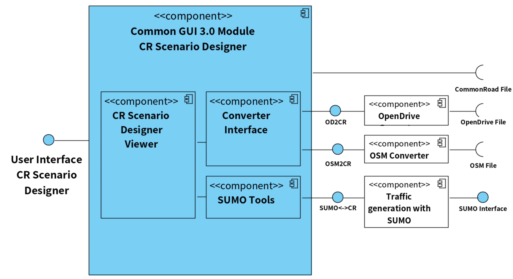
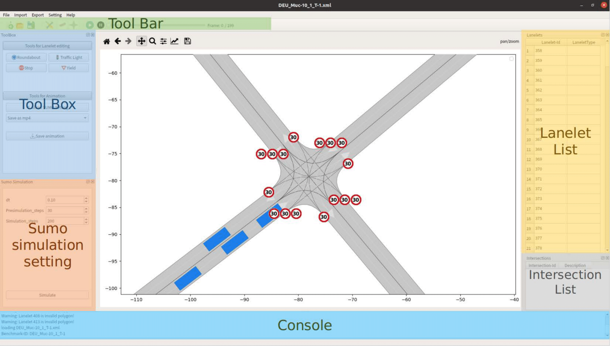
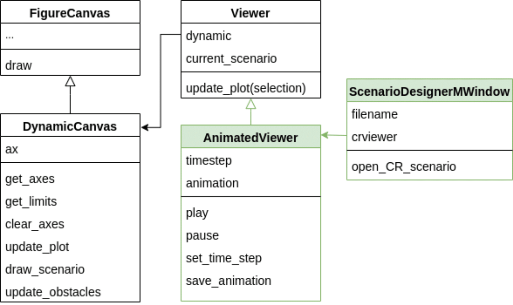
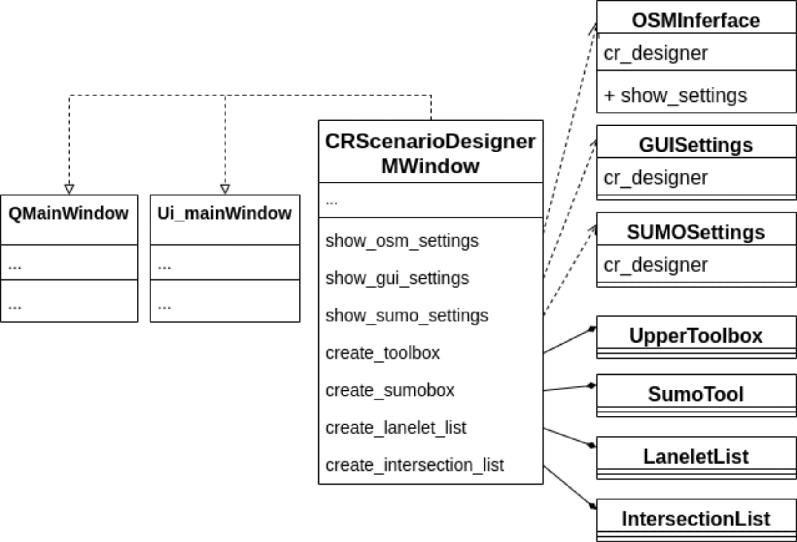
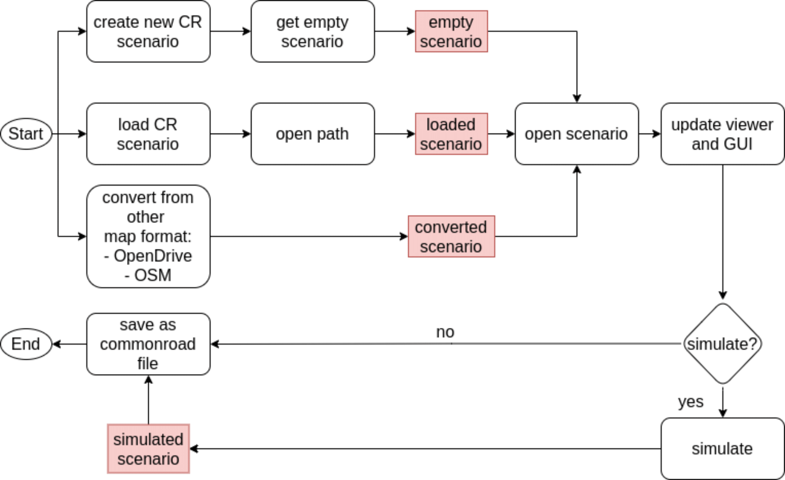

.. 
  Normally, there are no heading levels assigned to certain characters as the structure is
  determined from the succession of headings. However, this convention is used in Python’s
  Style Guide for documenting which you may follow:

  # with overline, for parts
  * for chapters
  = for sections
  - for subsections
  ^ for subsubsections
  " for paragraphs

GUI CommonRoad Scenario Designer (CRSD)
#############################################

.. _fig.component_diagram:

  Component diagram of CR Scenario Designer

CommonRoad Scenario Designer (CRSD) is a GUI, which
integrates all currently developed converters with CR scenario
generation tools.
As described in :numref:`fig.component_diagram`, the unified GUI structure of our
design is composed of three modules 1) a Scenario Viewer
module, 2) Converter Interface 3) and the SUMO Tool. The
Viewer module is responsible for the visualization of a loaded
scenario. The Converter Interface is designed to convert differ-
ent map types to CommonRoad. The Sumo Tool is in charge
of traffic generation and simulation.
The tool is designed to be able to import different types
of map files and automatically convert them into CR files, to
display them in the central area of the window and to provide
functions such as manual lanelet creation and editing, adding
of traffic signs and obstacles, as well as traffic simulation 
though SUMO tools.

Quick Start Guide
*****************

.. _fig.layout-crsd:

   Layout of CR Scenario Designer.

Implementation
**************
(gh) To achieve the designed concept of the new unified GUI, we set up a
new GUI structure with PyQt5, a Python GUI toolkit, and implemented
several modules including the viewer module and several converter
modules.

Viewer module
=============

The viewer module is designed to realize the visualization of a cr
scenario. It consists of four classes responsible for different
functionalities. All the visualization functions are developed based on
Matplotlib. It is an open-source project based on the Python language,
which aims to provide a comprehensive library for creating static,
animated, and interactive visualizations for Python. It is built with
the inspiration of MATLAB, which provides simple to use functionality
for data plotting. But different from MATLAB, Matplotlib is completely
designed using object-oriented methods, which are more suitable for GUI
applications because object instances can be manipulated in the program.

As the GUI is based on PyQt5, the matplotlib API is needed to
realize the scenario drawing under the QT framework. The
*FigureCanvasQTAgg* is the area onto which the figure is drawn. In
addition, the class *QWidget* of PyQt is one of its parent classes, so
that the class *FigureCanvas* is actually a widget component used to
display Matplotlib drawing results on the PyQt5 GUI. In another word, to
display the Matplotlib drawing results on the PyQt5 GUI, a
*FigureCanvas* component must be created. The *Figure* class is a chart
class for drawing. It is the main class in Matplotlib, which is
responsible for managing the drawing of various components in a graphics
window. The *Axes* is a class that manages the drawing of an area, so
that the Matplotlib drawing in the GUI happens mainly through the
operation of the *Axes* class and its managed sub-objects, e.g.,
coordinate axes (*Axis* class) or curves (*Line2D* class). One or more
*Axes* objects can be included in *Figure* object.

The relationship between a canvas, figure and axes is shown in :numref:`fig.label-axis`.

.. _fig.label-axis:
.. figure:: images/gui/Relation_GUI_Canvas_figure-1.png
   :alt: Relation between FigureCanvas, Figure and Axes.
   :name: Relation_canvas_fig_ax
   :width: 50.0%
   
   Relation between FigureCanvas, Figure and Axes.

.. _fig.uml-class-diagram-viewer:

   UML Class diagram of viewer module.

The class diagram of the viewer module in :numref:`fig.uml-class-diagram-viewer` illustrates the structure of
the involved classes. In the implementation of our viewer module, a
specific class *DynamicCanvas* is created for the drawing of scenarios.
It inherits from the parent class *FigureCanvas* and provides basic draw
*functionalities* such as clearing the axes, adjusting the plot and
drawing scenarios. The *Viewer* class provides the high-level drawing
functionality on the canvas, mainly including the update of the lanelets
visualization after the selection. Those functionalities operate on the
attribute dynamic of the *Viewer* class, which is an instance of class
*DynamicCanvas*. For the dynamic scenario visualization, the
animation-related methods are integrated into the class
*AnimatedViewer*, which inherits from the class *Viewer*. In this class,
functions such as initializing of the animation, setting the animation
to a specific time-step, saving the animation as .mp4 video or .gif
file, and playing or pausing the animation are provided. Therefore, this
class is instantiated as a central widget of the gui.

Converter module
================

The converter module converts map files from OpenDrive or OSM to
CommonRoad. It consists of one converter interface and two classes that
are responsible for OSM and OpenDrive conversion as shown in :numref:`fig.uml-class-diagram-converter`.

.. _fig.uml-class-diagram-converter:
.. figure:: images/gui/Converter_interface-1.png
   :alt: UML Class diagram of converter module.
   :name: Relation_converters
   :width: 50.0%

   UML Class diagram of converter module.

Considering future needs, the converter module is extensible for more
map converters. The Converter Interface provides abstract methods for
the conversion. It is implemented by the classes *OSMInterface* and
*Opendriveinterface* which give those methods a concrete and individual
meaning. That means those methods call different converter modules to
run the conversion.

.. _fig.gui-structure:

   UML Class diagram of GUI components.

GUI components
==============

The main window of CR Scenario Designer inherits from *QMainWindow* and
*UimainWindow*. :numref:`fig.gui-structure`  shows all the widgets contained in the GUI.
*QMainWindow* is the top-level window in PyQt. It can contain many
interface elements, such as menu bar, toolbars or status bars. and it
has its own layout. *UimainWindow* is the main window class
converted from the Ui file, which is generated by Qt Designer (a tool
for GUI development).

In the developed GUI, as presented in section Viewer module, a widget
for showing the scenario is placed as the central widget. The classes
*UpperToobox*, *SumoTool*, *LaneletList*, *IntersectionList* are all
widgets of PyQt and instantiated as dock widgets. The *UpperToobox* is
designed to be a widget that contains various kinds of tools, of which
all tools can be categorized to different foldable blocks, such as tools
for lanelet editing and tools for the animation export. The *SumoTool*
is responsible for the sumo simulation settings and it provides the
opportunity for the users to customize their preferred traffic scenario
through changing the given parameters. These widgets can all be easily
extended for future functionalities. The *LaneletList* and
*IntersectionList* are designed to show the corresponding lanelet and
intersection information of the current scenario.

In the setting menu, the GUI offers three different setting panels for
osm converter, SUMO converter and the GUI itself. Those setting panels
are also widgets of PyQt and can be called through buttons in the
settings menu. According to the given layout of the main window and
components, the complete interface we designed is shown in ::numref:`fig.layout-crsd`.

.. _fig.workflow-crsd:

   Workflow of CR Scenario Designer.

:numref:`fig.workflow-crsd` illustrates the basic workflow of our designed GUI. Users can load an
existing cr file, convert a file from another map format or create a new
scenario. The scenario can then be shown in the GUI, the user can get
detailed information about this scenario and then can choose if he/she
wants to simulate traffic with sumo, after that the created animation is
updated in the GUI and the user can save the scenario as a cr file.

GUI functionalities
==================

main_cr_desinger:                                  
-----------------
- menu-bar:
   - create_setting_actions
   - show_settings
      - OSM
      - OpenDrive
      - GUI
      - SUMO
   - create_import_actions
      - cr_2_osm
      - cr_2_od
      - osm_2_cr
      - od_2_cr
   - create_export_actions
   - create_help_actions
      - open_cr_web
   - create_file_actions
      - file_new
      - open_commonroad_file
      - open_path
      - open_scenario 
      - update_to_new_scenario
      - check_scenario
      - fil_save
   - create_action
- toolbar:
   - create_toolbar
   - play_animation
   - pause_animation
   - save_animation
- toolbox:
   - create_toolbox
- lanelet list:
   - create_lanelet_list
   - show_lanelet_list
- intersection list:
   - create_intersection_list
   - show_interstection_list
- sumobox:
   - create_sumobox
   - play_animation 
- viewer dock:
   - create_viewer_dock
- console:
   - create_console
- mouse operations
   - detect_slider_clicked
   - detect_slider_released
- others:
   - timestep_change
   - update_max_step
   - center 
   - processtrigger
   - closeWindow
   - closeEvent
   - tool_box1_show
   - tool_box2_show
   - update_view
   - make_trigger_exclusive

gui_viewer:
-----------
viewer module to visualize and inspect the created lanelet scenario

- zoom:
   - dynamicCanvas: provides zoom with the mouse wheel
   - zoom: zoom in/ out function in GUI by using mouse wheel
- scenario:
   - draw_scenario
   - update_obstacles
   - scenarioElementList
      - init
      - update
      - onClick
      - reset_selection: unselect all elements
- intersection list
   - init
   - update
- lanelet list
   - init
   - update
- viewer: functionality to draw a scenario onto a Canvas (Class)
   - init
   - open_scenario
   - update_plot: updates plot accordinly to the selection of scenario elements
   - get_paint_parameters: return the parameters for painting a lanelet regarding the selected lanelet
   - draw_lanelet_polygon
   - draw_lanelet_vertices
   - draw_arrow_on_lanelet
   - select_lanelets
- AnimatedViewer
   - init
   - open_scenario
   - init_animation
   - draw_frame
   - play: plays animation
   - pause
   - set_timestep
   - save_animation
   - calc_max_timestep
- others:
   - merge_dict: deeply merges two dicts
   - clear_axes
   - get_axes
   - git_limits
   - update_plot: draw canvas

gui_toolbox:
------------
- SectionExpandButton: QPushbutton that can expand or collabse its section
   - init
   - on_clicked: toggle/expand section
- UpperToolbox: Class
   - init
   - add_section: adds a collapsible section
   - clicked
   - define_section
   - selection_change
   - add_button
   - add_widget
- SumoTool: Class: widget to config the sumo simulation tools
   - init
   - initUI
   - define_sections
   - add_selections
   - add_button
   - add_widget

