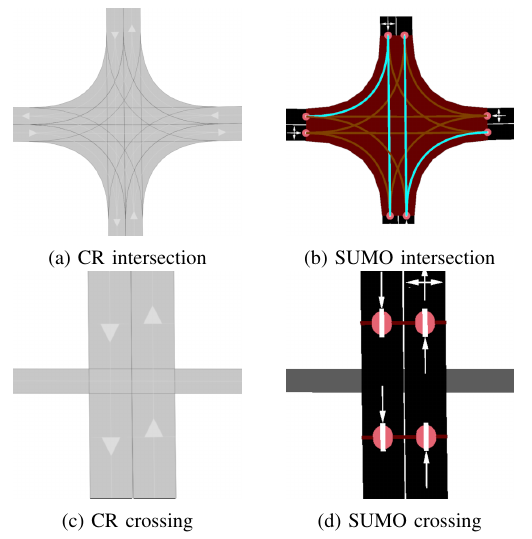

.. 
  Normally, there are no heading levels assigned to certain characters as the structure is
  determined from the succession of headings. However, this convention is used in Python’s
  Style Guide for documenting which you may follow:

  # with overline, for parts
  * for chapters
  = for sections
  - for subsections
  ^ for subsubsections
  " for paragraphs

Vehicle Simulation using Simulation of Urban Mobility (SUMO)
############################################################
Simulation of Urban Mobility (SUMO) [6] is a microscopic 
traffic simulator which is able to simulate traffic
participants, given a road network in it’s own graph like format
of nodes and edges. Nodes represent ends of edges or other
fixed position objects (eg. traffic signs) and are connected
by edges. Each edge in turn can consist of multiple lanes.
Realistic traffic constrains such as traffic lights and partially
traffic signs can also be modelled. Additionally it provides
the capability to simulate multiple types of traffic participants
and interactions between them. Optionally trips for pedestrians
and vehicles from one edge in the network to another can
be automatically generated. SUMO also provides a set of
tools for programmatically interacting with a network, namely
NETEDIT. 

Quick Start Guide
*****************
To simulate traffic on a CommonRoad Scenario, you firstly need to install SUMOs dependencies.
For a detailed explanation on this process see :ref:`installation`.

Then refer to the provided example file `example file <https://gitlab.lrz.de/cps/commonroad-map-tool/-/blob/develop/crmapconverter/sumo_map/example.py>`_ to convert a commonroad .xml
file to SUMO, simulate on traffic on it and save the result to disk:

.. code:: bash

  # add the current module to the python path
  export $PYTHONPATH="$PYTHONPATH:$(pwd)"
  python crmapconverter/sumo_map/example.py

Implementation
**************
SUMO is a microscopic traffic simulator which is able to simulate traffic participants, 
given a road network in it's own graph like format of nodes and edges.
Nodes represent ends of edges or other fixed position objects (eg. traffic signs) and are connected by edges.
Each edge in turn can consist of multiple lanes.
Realistic traffic constrains such as traffic lights and partially traffic signs can also be modelled.
Additionally it provides the capability to simulate multiple types of traffic participants and interactions between them. 
Optionally trips for pedestrians and vehicles from one edge in the network to another can be automatically generated.
SUMO also provides a set of tools for programmatically interacting with a network, namely NETEDIT.

Dynamic Obstacle Simulation with SUMO
=====================================

(mf) Simulation of traffic participants different from an ego-vehicle is
handled by SUMO, which utilizes it’s own network format, more details in.
We will not go into detail on the network conversion but focus on
LaneletType conversion in. Afterwards, random trips are generated by
SUMO for each traffic participant, details in. Then the user can
optionally have our tool automatically generate traffic lights at
intersections in :numref:`lanelet_type_conversion`. Finally the simulation SUMO simulation is executed
and the results converted back to CommonRoad.

.. _lanelet_type_conversion:

   Converted CommonRoad lanelet intersections and crossings (left) to SUMO networks (right) 

Lanelet type conversion
=======================

In CommonRoad every lanelet has one or more LaneletTypes describing the
type of a Lanelet and giving an indication of
usage. However in SUMO each lane can be assigned to one more ``vClass`` attributes, 
which define
what type of vehicle is allowed to use the respective lane. To convert
from one representation to the other we therefore propose a mapping
:math:`t: \mathbb{P}(\texttt{LaneletType}) \rightarrow \mathbb{P}(\texttt{vClass})`
mapping the set of all CommoRoad Lanelet types to the set of all
vClasses. Every converted SUMO lane is then assigned a set of vClasses
according to the LaneletTypes of the correspondin CommonRoad lanelet
under the mapping :math:`t`.

When converting intersections from CommonRoad to SUMO all overlapping
lanelets are merged into a SUMO junction object. However, in this
process we need to avoid adding junctions for lanelets of different
types, to not create addional junctions during the conversion which are
not present in the source CommonRoad file. Therefore, we propose to only
merge two lanelets Lanelet types :math:`L_1, L_2` iff.

.. math:: t(L_1) \cap t(L_2) \neq \emptyset

This results in SUMO junctions being merged correctly as given in ,
where the overlapping Lanelets of one type (*urban*) in are merged into
one junction in . In two crossing paths of different types are given.
The horizontal one being of different type to the vertical roads
(*crosswalk* and *urban*) so no SUMO junction is generated between the
two in :numref:`lanelet_type_conversion`.

Pedestrian path generation
==========================

Pedestrian paths through the network are randomly generated in a similar
fashion as the already existing vehicle trips, by using the random trips
functionality provided by SUMO. This built in functionality generates
trips (start, to end edge) randomly based on distributions provided for
each allowed ``vClass`` on a lane. Therefore, removing the need to
explicitly specify which vehicle classes should be generated.
Interaction between the different types then occurs during the
simulation based on each agent having to wait at intersections and
following traffic rules.

.. _traffic_light_conversion:
.. figure:: images/sumo/converted_sumo_traffic_intersection.png
   :alt: Automatic traffic light generation process (from left to right)
   :name: fig:sumo_auto_traffic_lights:selected_lanelet

   Automatic traffic light generation process (from left to right)

Traffic Light conversion & generation
=====================================

Traffic lights in CommonRoad are specified by one or more lanelets
referencing them. Their placement is per default at the end of the
referencing lanelet.
Optionally a position can be explicitly defined for more detailed
placement at the side of the road. While cycles describing each phase of
the traffic light are represented by the tuple
:math:`(\text{color}, \text{duration})`. In SUMO, cycle information is
represented identically to CommonRoad. However, SUMO represents time in
seconds :math:`(sec)` and CommonRoad in multiples of the timestep
:math:`n \cdot \Delta t, n \in \mathbb{N}_0`, forcing conversion between
the two systems. Traffic lights converted to SUMO are then simulated,
and their resulting effects on the dynamic obstacles are imported back
to a CommonRoad scenario.

Additionally we propose the generation of traffic light systems with
collision free cycles at intersections. This generation is done by:

#. Having the user select a lanelet in the network, which lies in an
   intersection. The selected lanelet has to lie in an intersection, as
   SUMO only allows for placement of traffic lights at SUMO junctions.
   Therefore the converter has to make sure, a selected lanelet lies in
   an intersection, which is converted to a SUMO junction.

#. Mapping the selected lanelet to the corresponding SUMO junction and
   generating the traffic light system for the whole intersection using
   SUMOs built in tool ``NETEDIT``.

#. Converting the generated traffic light back to CommonRoad. This
   involves reversing the conversion process for CommonRoad traffic
   lights to SUMO described in the previous paragraph.

Visually this process is shown in :numref:`traffic_light_conversion`. 
Where show the user selecting
a lanelet (red) in *CR Scenario Designer*. Other colors in this figure
are representing adjacency information. Next shows the generated traffic
light system (a set of traffic lights, associated with each other by an
intersection) in SUMO, with the cycle state of each traffic light in the
respective color. Additionally the collision free generation of the
cycles is shown by opposing lanes having the same color. displays the
conversion result of the generated traffic lights.