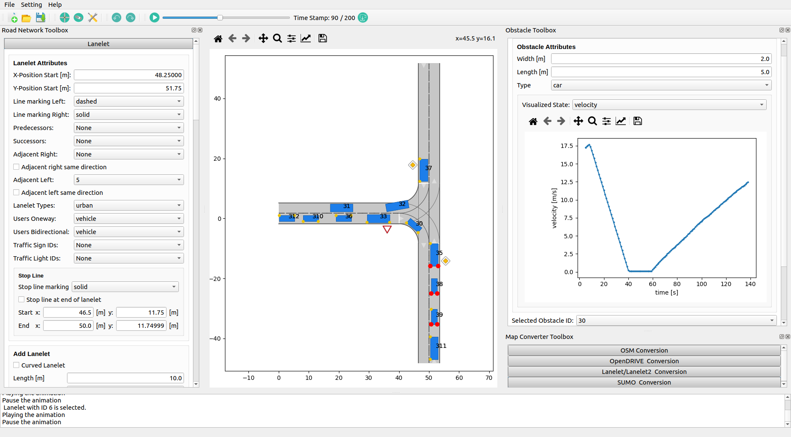

.. 
  Normally, there are no heading levels assigned to certain characters as the structure is
  determined from the succession of headings. However, this convention is used in Python’s
  Style Guide for documenting which you may follow:

  # with overline, for parts
  * for chapters
  = for sections
  - for subsections
  ^ for subsubsections
  " for paragraphs

CommonRoad Scenario Designer GUI
#############################################

The CommonRoad Scenario Designer is a graphical user interface (GUI), which
integrates all currently developed converters with and functionalities to edit and create new maps and test scenarios
for motion planning of autonomous vehicles.

Quick Start Guide
*****************

You can start the GUI via the command line:

Option1 : ``crdesigner``

Option 2: ``crdesigner gui``

You can also start the GUI by executing a Python file with ``python crdesigner/io/gui/commonroad_scenario_designer_gui.py``

.. _fig.layout-crsd:

   Layout of the CommonRoad Scenario Designer.

Implementation Details
**********************
The GUI is based on Matplotlib and PyQt5 and contains
several modules including the viewer module which is able to show videos, zoom in/out, and react on clicking.

The viewer module is designed to realize the visualization of a CommonRoad
scenario. It consists of four classes responsible for different
functionalities. All the visualization functions are developed based on
Matplotlib. It is an open-source project based on the Python language,
which aims to provide a comprehensive library for creating static,
animated, and interactive visualizations for Python. It is built with
the inspiration of MATLAB, which provides simple to use functionality
for data plotting. But different from MATLAB, Matplotlib is completely
designed using object-oriented methods, which are more suitable for GUI
applications because object instances can be manipulated in the program.

As the GUI is based on PyQt5, the matplotlib API is needed to
realize the scenario drawing under the QT framework. The
*FigureCanvasQTAgg* is the area onto which the figure is drawn. In
addition, the class *QWidget* of PyQt is one of its parent classes, so
that the class *FigureCanvas* is actually a widget component used to
display Matplotlib drawing results on the PyQt5 GUI. In another word, to
display the Matplotlib drawing results on the PyQt5 GUI, a
*FigureCanvas* component must be created. The *Figure* class is a chart
class for drawing. It is the main class in Matplotlib, which is
responsible for managing the drawing of various components in a graphics
window. The *Axes* is a class that manages the drawing of an area, so
that the Matplotlib drawing in the GUI happens mainly through the
operation of the *Axes* class and its managed sub-objects, e.g.,
coordinate axes (*Axis* class) or curves (*Line2D* class). One or more
*Axes* objects can be included in *Figure* object.
