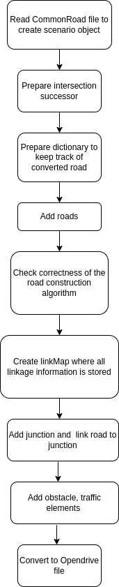

.. 
  Normally, there are no heading levels assigned to certain characters as the structure is
  determined from the succession of headings. However, this convention is used in Python’s
  Style Guide for documenting which you may follow:

  # with overline, for parts
  * for chapters
  = for sections
  - for subsections
  ^ for subsubsections
  " for paragraphs

CommonRoad to OpenDRIVE Conversion
##################################

This conversion allows you to convert a road network description from the
`CommonRoad format <https://gitlab.lrz.de/tum-cps/commonroad-sc
enarios/blob/master/documentation/XML_commonRoad_2020a.pdf>`_ (Version 2020a) 
to the `OpenDRIVE format <https://www.asam.net/standards/detail/opendrive/>`_

Quick Start Guide
*****************

Command Line Interface
========================

Want to quickly convert a XML file with a CommonRoad scenario
to an XODR file detailing a OpenDRIVE scenario?

Use the command
``crdesigner map-convert-commonroad -i input-file.xml -o output-file.xodr``.

.. note::
   You have to activate the Python environment in which the CommonRoad Scenario Designer is
   installed before using the command line.

For example, ``crdesigner map-convert-commonroad -i test.xml -o new_converted_file_name.xodr``
produces a file called *new_converted_file_name.xodr*

.. note::
   If no output file name is specified, the converted file will be called input-file.xodr,
   e.g., ``crdesigner map-convert-opendrive -i test.xml`` produces a file called *test.xodr*.

You can also use the GUI to convert an OpenDRIVE file.
The GUI can be started from command line with ``crdesigner`` or ``crdesigner gui``.

Python APIs
==========================================

.. code:: python

	from crdesigner.input_output.api import commonroad_to_opendrive
	from crdesigner.map_conversion.opendrive.cr_to_opendrive.dataloader import DataLoader
	from crdesigner.map_conversion.opendrive.cr_to_opendrive.converter import Converter

	input_file = "" #path to CommonRoad file
	output_file = "" #path where OpenDRIVE file to be stored

	# -------------------------------------- Option 1: General API --------------------------------------------
	# load xml file, preprocess it, and convert it to a respective OpenDRIVE file
	commonroad_to_opendrive(input_file, output_file)

    # ------------------------------- Option 2: CommonRoad conversion APIs ------------------------------------
	# load the xml file and preprocess it
	data = DataLoader(input_file)

	scenario, successors, ids = data.initialize()
	converter = Converter(input_file, scenario, successors, ids)
	converter.convert(output_file) 

Implementation Details
**********************

Initially the CommonRoad xml file is read to create corresponding scenario object along with intersection successor and dictionary of converted roads.
Then the scenario object is converted into corresponding OpenDRIVE xodr file.

Code Structure
==============
Here is a simplified overview about the code structure (the presented code
structure is not complete)::

    /map_conversion/opendrive
    │
    └── /cr_to_opendrive
        ├── /elements
        ├── /maps
        ├── /reference_maps
        ├── /utils
        ├── converter.py
        ├── dataloader.py
        └── test_converter.py

- `/elements`: This directory contains various tools and files that are used for initiation of various opendrive objects and used in various stages during the conversion of scenario object(lanelets) to opendrive file.
- `/maps`: This directory contains two directory: commonroad and Opendrive. The commonroad directory contain sample of commonroad files and the opendrive directory contains sample of opendrive files. 
- `/reference_maps`: This directory contains sample of opendrive files which will be used as reference for testing converted opendrive files.
- `/utils`: This directory contains two files in which one is used to preprocess the polyline for road element and another is used to write the opendrive file using opendrive tree element.
- `converter.py`: Module to convert scenario object to opendrive file in  which lanelets are used to construct road, junctions, junction linkage, obstacles, traffic element. 
- `dataloader.py`: Module to convert to xml file to scenario object which includes preparation of intersection successor and preparation of a dictionary with lanelet ids that keep track of converted lanelet. 
- `test_converter.py`: Module for the implementation of test_case for commonroad to opendrive conversion. 

.. _fig.layout-commonroad-to-opendrive:

   CommonRoad to OpenDRIVE conversion flow chart.

## Need detail explanation
Create Scenario Object  
======================

## Need detail explanation
Convert Scenario Object to OpenDRIVE File 
========================================
- Add roads
- Check correctness of the road construction algorithm
- Create linkMap where all linkage information is stored
- Add junction and  link road to junction
- Add obstacle, traffic elements 
- Convert to Opendrive file

