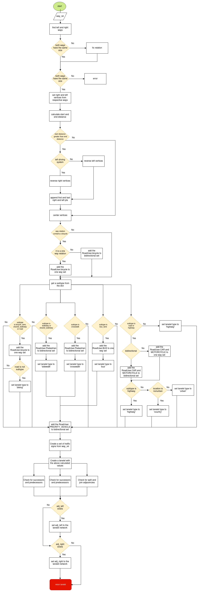
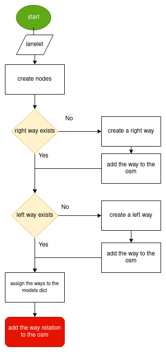

.. 
  Normally, there are no heading levels assigned to certain characters as the structure is
  determined from the succession of headings. However, this convention is used in Python’s
  Style Guide for documenting which you may follow:

  # with overline, for parts
  * for chapters
  = for sections
  - for subsections
  ^ for subsubsections
  " for paragraphs

Converting Lanelet/Lanelet2 to CommonRoad and vice versa
########################################################

Lanelet/Lanelet2 to CommonRoad
******************************
This conversion allows you to convert a road network description from the
`Lanelet/Lanelet2 format <https://github.com/fzi-forschungszentrum-informatik/Lanelet2>`_ to
the `CommonRoad format <https://gitlab.lrz.de/tum-cps/commonroad-sc
enarios/blob/master/documentation/XML_commonRoad_2020a.pdf>`_ (Version 2020a).

Quick Start Guide
=================

Command Line Interface
----------------------

Want to quickly convert an Lanelet/Lanelet2 file to a CommonRoad map?

Use the command
``crdesigner map-convert-lanelet -i input-file.osm -o output-file.xml``.

.. note::
   You have to activate the Python environment in which the CommonRoad Scenario Designer is
   installed before using the command line.

   If your scenario is based in another UTM zone then the default zone (UTM 32 North) you
   should specify the projection string using ``--proj``.
   E.g: ``crdesigner map-convert-lanelet -i test.osm -o new_converted_file_name.xml
   --proj "+proj=utm +zone=32 +datum=WGS84 +ellps=WGS84"``.

For example, ``crdesigner map-convert-lanelet -i test.osm -o new_converted_file_name.xml``
produces a file called *new_converted_file_name.xml*

.. note::
   If no output file name is specified, the converted file will be called <input-file>.xml,
   e.g., ``crdesigner map-convert-lanelet -i test.osm`` produces a file called *test.xml*.

You can also use the GUI to convert an lanelet file.
The GUI can be started from command line with ``crdesigner`` or ``crdesigner gui``.

Python APIs
-----------

.. code:: python

    from commonroad.scenario.scenario import Tag
    from commonroad.common.file_writer import CommonRoadFileWriter, OverwriteExistingFile
    from commonroad.planning.planning_problem import PlanningProblemSet

    from crdesigner.config.lanelet2_config import lanelet2_config
    from crdesigner.map_conversion.map_conversion_interface import lanelet_to_commonroad

    input_path = ""
    output_path = ""
    lanelet2_config.adjacencies = True

    # load lanelet/lanelet2 file, parse it, and convert it to a CommonRoad scenario
    scenario = lanelet_to_commonroad(input_path)

    # store converted file as CommonRoad scenario
    writer = CommonRoadFileWriter(
        scenario=scenario,
        planning_problem_set=PlanningProblemSet(),
        author="Sebastian Maierhofer",
        affiliation="Technical University of Munich",
        source="CommonRoad Scenario Designer",
        tags={Tag.URBAN},
    )
    writer.write_to_file(output_path, OverwriteExistingFile.ALWAYS)

Implementation Details
======================

As OSM lanelet boundaries are saved as geographic coordinates (lat, lon) and CommonRoad saves the
boundaries as cartesian (map projection) coordinates, a projection is needed for the conversion.
This projection is provided as a proj-string, as defined by the PROJ library (https://proj.org/index.html).
A proj-strings holds the parameters of a given coordinate transformation.

This project uses pyproj (https://pypi.org/project/pyproj/) which is a Python interface to the PROJ library.
The default proj-string defined here is "+proj=utm +zone=32 +ellps=WGS84", which describes
a Universal Transversal Mercator projection.

A few comments on the conversion:

- A lanelet and its successor share two nodes (last ones of the lanelet, first ones of the successor). Therefore, to detect this relation and save it in the CommonRoad file, dictionaries are used which save the node-lanelet relation, e.g., "Node is first left node of which lanelet" (first_left_nodes[node_id] = lanelet_id).
- Same for lanelet predecessor relationship.
- If lanelets in OSM share a common way, they are adjacent to each other. As a way can have only one direction, and if it is shared by lanelets having opposite driving directions, the vertices of one boundary of one of the two lanelet have to be reversed after conversion. This boundary is by default the left boundary considering the right-driving system in most of the world. You can set it to right by using the argument "left_driving_system=True" when calling the Converter.
- Lanelets can be adjacent without sharing a common way, because two ways can describe the same trajectory, but with a different number of nodes. This converter can still compare two vertices which resulted from converting two possible adjacent ways to the CommonRoad lanelet format and determine if the corresponding lanelets are adjacent. However, this is computationally quite intensive and is thus disabled by default (enable it with "--adjacencies" in the command line tool or setting "detect_adjacencies=True" when calling the converter.)

Flowchart of the conversion function
====================================
To get a better understanding of the conversion process, a flowchart of the function that transforms the WayRelation (Lanelet2/OSM format) to the Lanelet (CommonRoad format) is given below:

Both left and right ways of the WayRelation object have to be of the same size. If not, the function tries to fix the issue by resizing one of the ways, raising an error in case of a failutre. If there is no failure, the function creates left and right vertices from those respective ways. Potentially, it reverses them, depending on the driving system and the location of the start and the end points of those newly created vertices. Special meanings of the WayRelation, such as the road user, direction or the road type are extracted and stored as Lanelet's attributes. A set of traffic signs, from the WayRelation object, is created, after which the function checks for potentially already existing successor and predecessor laneletes.

CommonRoad to Lanelet2
**********************
This conversion allows you to convert a road network description from
the `CommonRoad format <https://gitlab.lrz.de/tum-cps/commonroad-sc
enarios/blob/master/documentation/XML_commonRoad_2020a.pdf>`_ (Version 2020a) format to the
`Lanelet/Lanelet2 format <https://github.com/fzi-forschungszentrum-informatik/Lanelet2>`_ format.

Quick Start Guide
=================

Command Line Interface
----------------------

Want to quickly convert an CommonRoad map to a OSM lanelet map?

Use the command
``crdesigner map-convert-lanelet -i input-file.xml -o output-file.osm -c``.

.. note::
   You have to activate the Python environment in which the CommonRoad Scenario Designer is
   installed before using the command line.

   If your scenario is based in another UTM zone then the default zone (UTM 32 North) you
   should specify the projection string using ``--proj``.
   E.g: ``crdesigner map-convert-lanelet -i test.xml -o new_converted_file_name.osm -c
   --proj "+proj=utm +zone=32 +datum=WGS84 +ellps=WGS84"`` .

For example, ``crdesigner map-convert-lanelet -i test.xml -o new_converted_file_name.osm -c``
produces a file called *new_converted_file_name.osm*

.. note::
   If no output file name is specified, the converted file will be called <input-file>.xml,
   e.g., ``crdesigner map-convert-lanelet -i test.xml -c`` produces a file called *test.osm*.

You can also use the GUI to convert an lanelet file.
The GUI can be started from command line with ``crdesigner`` or ``crdesigner gui``.

Python API
-----------

.. code:: python

    from crdesigner.config.lanelet2_config import lanelet2_config
    from crdesigner.map_conversion.map_conversion_interface import commonroad_to_lanelet

    input_path = ""
    output_name = ""
    config = lanelet2_config
    config.autoware = False

    # load CommonRoad file and convert it to lanelet format
    commonroad_to_lanelet(input_path, output_name, config)

Implementation Details
======================

Converting back from cartesian to geographic coordinates requires, like mentioned in the above description of the
reverse conversion, a projection.

This code of this conversion take some points into account:

- If a lanelet has a successor, the converted nodes at the end of the lanelet have to be the same as the nodes of the converted successor.
- Same lanelet predecessor relationships.
- If a lanelet is adjacent to another lanelet, and the vertices of the shared border coincide, they can share a way in the converted OSM document.

Flowchart of the conversion function
====================================

To get a better understanding of the conversion process, a flowchart of the function that transforms the lanelet (CommonRoad format) to the WayRelation (Lanelet2/OSM format) is given below:

The function takes a lanelet as an input and creates nodes based on those lanelet's vertices. As the nodes form right and left ways, the function checks if those ways already exist. If not, the function creates those ways, maps them to the way relation, and assigns them to the osm object's dictionary. If the way already exists, there is no need to create it, as the function maps the same id as of the newly found way to the way relation in the previously mentioned dictionary.

