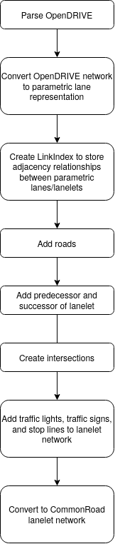

.. 
  Normally, there are no heading levels assigned to certain characters as the structure is
  determined from the succession of headings. However, this convention is used in Python’s
  Style Guide for documenting which you may follow:

  # with overline, for parts
  * for chapters
  = for sections
  - for subsections
  ^ for subsubsections
  " for paragraphs

OpenDRIVE to CommonRoad Conversion
##################################

This conversion allows you to convert a road network description from the
`OpenDRIVE format <https://www.asam.net/standards/detail/opendrive/>`_ to
the `CommonRoad format <https://gitlab.lrz.de/tum-cps/commonroad-sc
enarios/blob/master/documentation/XML_commonRoad_2020a.pdf>`_ (Version 2020a).
Its theoretical background is detailed in our paper:
M. Althoff, S. Urban, and M. Koschi, "Automatic Conversion of Road Networks from OpenDRIVE to Lanelets,"
in Proc. of the IEEE International Conference on Service Operations and Logistics, and Informatics, 2018
(https://mediatum.ub.tum.de/doc/1449005/1449005.pdf).

Since the release of the paper, various updates have been implemented in the code to enhance the converter.

Quick Start Guide
*****************

Command Line Interface
========================

Want to quickly convert an XODR file detailing a OpenDRIVE scenario
to a XML file with a CommonRoad scenario?

Use the command
``crdesigner map-convert-opendrive -i input-file.xodr -o output-file.xml``.

.. note::
   You have to activate the Python environment in which the CommonRoad Scenario Designer is
   installed before using the command line.

For example, ``crdesigner map-convert-opendrive -i test.xodr -o new_converted_file_name.xml``
produces a file called *new_converted_file_name.xml*

.. note::
   If no output file name is specified, the converted file will be called input-file.xml,
   e.g., ``crdesigner map-convert-opendrive -i test.xodr`` produces a file called *test.xml*.

You can also use the GUI to convert an OpenDRIVE file.
The GUI can be started from command line with ``crdesigner`` or ``crdesigner gui``.

Python API
==========================================

.. code:: python

    from pathlib import Path
    from commonroad.scenario.scenario import Tag
    from commonroad.common.file_writer import CommonRoadFileWriter, OverwriteExistingFile
    from commonroad.planning.planning_problem import PlanningProblemSet

    from crdesigner.config.opendrive_config import open_drive_config
    from crdesigner.map_conversion.map_conversion_interface import opendrive_to_commonroad

    input_path = ""
    output_path = ""
    config = open_drive_config
    config.lanelet_types_backwards_compatible = False

    # load OpenDRIVE file, parse it, and convert it to a CommonRoad scenario
    scenario = opendrive_to_commonroad(Path(input_path))

    # store converted file as CommonRoad scenario
    writer = CommonRoadFileWriter(
        scenario=scenario,
        planning_problem_set=PlanningProblemSet(),
        author="Sebastian Maierhofer",
        affiliation="Technical University of Munich",
        source="CommonRoad Scenario Designer",
        tags={Tag.URBAN},
    )
    writer.write_to_file(output_path, OverwriteExistingFile.ALWAYS)

Implementation Details
**********************

Subsequently, the parsing of an OpenDrive file to a Python object,
the converting to a network of ``ParametricLane`` object and the
conversion from parametric lanes to lanelets is explained.

The three main types of formats are:

- `OpenDRIVE format`: In OpenDRIVE, roads are specified based on a reference path. Individual lanes are created by specifying a lateral distance from a reference path. Lanes with a negative lane number (ID) have the same direction as the reference path and positive IDs indicate that the direction is opposite.
- `Lanelet format`: Lanelets are atomic, interconnected, and drivable road segments. A lanelet is defined by its left and right bound, where each bound is represented by an array of points.Two lanelets are called longitudinally adjacent, if the left and right start points of one lanelet are identical with the corresponding final points of the next lanelet in driving direction. The longitudinal, left, right, and empty adjacencies form a road network that can be modeled as a directed graph.
- `Parametric lanes`: In OpenDRIVE, lanes are merged by gradually reducing their width to zero or split by gradually increasing the width from zero. In a lanelet network, the end points have to coincide with starting points of another lanelet so that splitting and merging is realized. To conveniently perform the conversion of merging and splitting, the concept of parametric lanes is used. These eliminate the dependency of each lane on its inner neighbor by specifying the borders with respect to the reference path. The following parameters are required for parametric lanes: 1 ) offset specifying distance from the beginning of the reference path of the considered section, 2) path length of the parametric lane, 3) inner and outer borders specified as distances to the reference path varying along the reference path.

Code Structure
==============
Subsequently, we provide a simplified overview about the code structure (the presented code
structure is not complete)::

    /map_conversion/opendrive
    │
    ├── /opendrive_parser
    │   ├── /elements
    │   └── parser.py
    │
    └── /opendrive_conversion
        ├── /plane_elements
        ├── converter.
        ├── network.py
        ├── conversion_lanelet.py
        └── conversion_lanelet_network.py

- `/opendriveparser`: All files to parse the open drive xodr files.
- `/elements`: This directory contains various tools and files that are used throughout all stages of parsing and initiation of various commonroad objects.
- `parser.py`: Parses XML tree, returns OpenDRIVE object, parse road type, profiles and signals and append to road object.
- `/opendriveconversion`: All files to convert the parsed open drive objects to a CommonRoad scenario.
- `/plane_elements`: This directory contains various tools and files used to define CommonRoad objects such as border, geo reference, parametric lanes, and traffic signals.
- `converter.py`: Module for the logic behind converting OpenDRIVE to ParametricLanes which includes converting from lane_sections to parametric_lanes, determine_neighbours of lanes and creating outer lane border.
- `network.py`: Module to contain network which can load an opendrive object and then export to lanelets. Internally, the road network is represented by ParametricLanes with a LinkIndex which stores the neighbor relations between the parametric lanes which are essentially index of all links in the file and saves everything as successors and predecessors.
- `conversion_lanelet.py`: Module to enhance lanelet class with helper functions for access/manipulation of various objects especially lanelet_ids, borders, width of lanes (s_pos), concatenate lanes, and adjacent lanes so it can be used for conversion from the opendrive format.
- `conversion_lanelet_network.py`: Module to enhance LaneletNetwork class so it can be used for conversion from the OpenDRIVE format and further enable it to modify its lanelets.

.. _fig.layout-opendrive:

   OpenDRIVE conversion flow chart.

Parsing OpenDRIVE
==================

Parsing the OpenDRIVE xodr file is straightforward. We mirror the OpenDRIVE document
with a Python class in this package. The XML is parsed and from the results an OpenDRIVE object is created.

Converting to Network of ParametricLanes
========================================
Every width section in OpenDRIVE gets converted into a ParametricLane and
in turn every lane section gets converted into a ParametricLaneGroup which consists of multiple ParametricLanes.
ParametricLanes have a ParametricLaneBorderGroup which has references to the left and right border of the
ParametricLane and to the offset of each borders, which indicate at which point of the border the ParametricLane
starts, as a Border can be used by multiple ParametricLanes.

Calculating Cartesian coordinates at a position on a border works as follows:

- The border has a reference border which calculates its coordinates.
- The border has one or more tuples of width coefficients. With the width coefficients which apply at the position (determined by a width coefficients offset), it calculates the width of its reference border.
- The width is added to the coordinates of the reference border in orthogonal direction, which results in coordinates of the border at a specific position.

The position on a border is always specified in a curve parameter ds which follows the path of the border.
Each reference border is a border again, until the last reference border, which in turn is a reference path,
a PlaneView object. This PlaneView consists of the basic geometries which constitute the reference path.

Converting ParametricLanes to Lanelets
======================================

Challenge: Splitting and joining lanelets
------------------------------------------

As detailed in Figure 6 of the accompanying paper, if a lanelet splits from
another lanelet (merge in the paper) or joins into another lanelet, an additional
border has to be created, because the end points of the splitting or joining lanelet
have to coincide with the the lanelet it splits from or joins into, respectively.
Creating the new border works by offsetting the other, not to be recreated border of the lanelet
by a linear varying distance, such that for e.g. a lanelet which joins into another lanelet,
the new width at the start is equal to the old width at the start and the new width at the end is equal to the
width of the lanelet it joins into at the end.

The difficulty in determining the parameters used to calculate the new border was amplified by following problems:

- Determining the position from where to calculate the new border. In general, this position is where the width of the joining/splitting lanelet has a zero derivative.
- The joining/splitting of a border could extend over multiple, successive lanelets.
- The joining/splitting lanelet has to be adjacent all the time to the lanelet it joins into or splits from, respectively.

Smaller issues
--------------

- If lanelets have zero width everywhere, they are discarded.
- If a lanelet has an adjacent neighbor, and the successor of this neighbor and the lanelets successor are adjacent too, the lanelets and their successors can be each merged into one lanelet in most circumstances.
