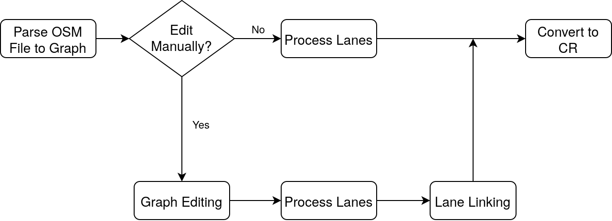
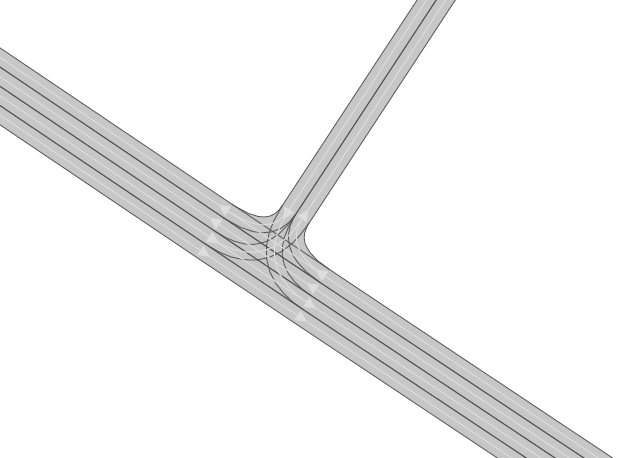
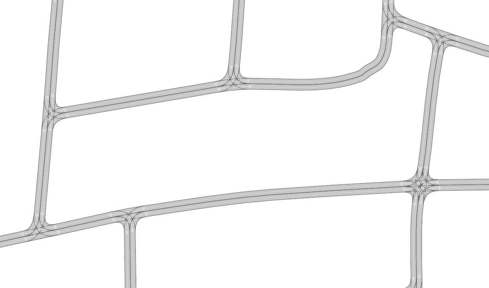
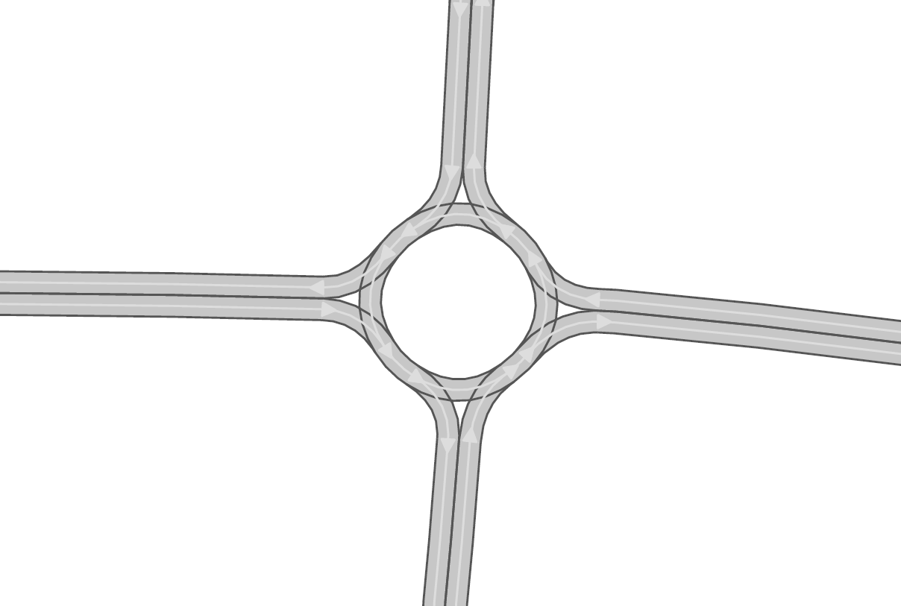
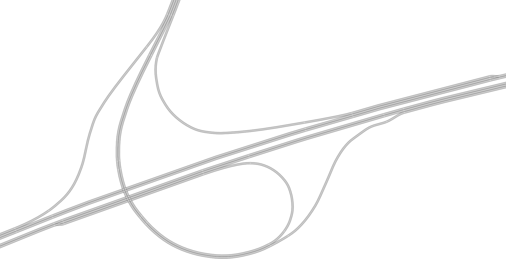
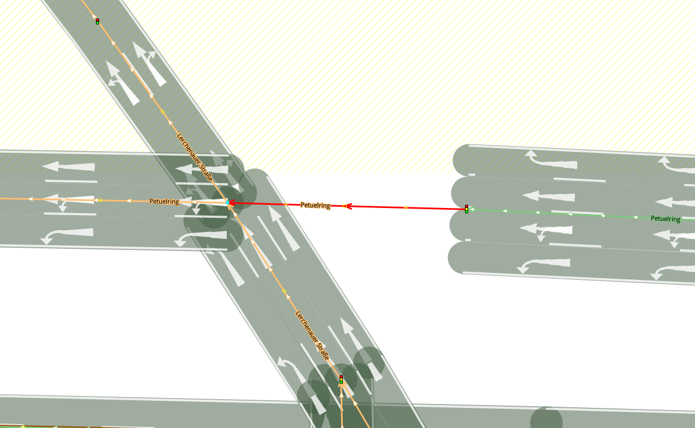
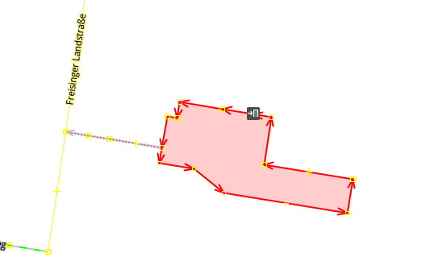
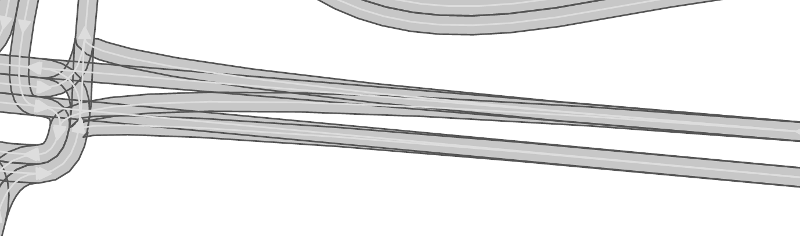
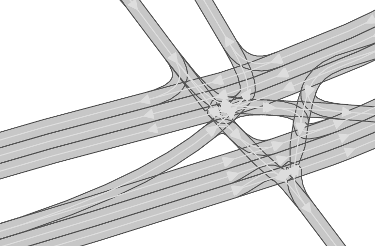

.. 
  Normally, there are no heading levels assigned to certain characters as the structure is
  determined from the succession of headings. However, this convention is used in Python’s
  Style Guide for documenting which you may follow:

  # with overline, for parts
  * for chapters
  = for sections
  - for subsections
  ^ for subsubsections
  " for paragraphs

Open Street Maps (OSM) to CommonRoad Conversion
###############################################

This conversion allows you to convert road networks from the
`OpenStreetMap (OSM) format <https://www.openstreetmap.org>`_ format to the CommonRoad format (2020a).

Quick Start Guide
*****************

Command Line Interface
========================

Want to quickly convert an OSM file detailing an OSM map to a XML file with a CommonRoad scenario?

Use the command
``crdesigner map-convert-osm -i input-file.osm -o output-file.xml``.

.. note::
   You have to activate the Python environment in which the CommonRoad Scenario Designer is
   installed before using the command line.

For example, ``crdesigner map-convert-osm -i test.osm -o new_converted_file_name.xml``
produces a file called *new_converted_file_name.xml*

.. note::
   If no output file name is specified, the converted file will be called input-file.xml,
   e.g., ``crdesigner map-convert-osm -i test.osm`` produces a file called *test.xml*.

You can also use the GUI to convert an OpenDRIVE file.
The GUI can be started from command line with ``crdesigner`` or ``crdesigner gui``.

Python API
==========================================

.. code:: python

    from crdesigner.map_conversion.map_conversion_interface import osm_to_commonroad

    from commonroad.scenario.scenario import Tag
    from commonroad.common.file_writer import CommonRoadFileWriter, OverwriteExistingFile
    from commonroad.planning.planning_problem import PlanningProblemSet
    from crdesigner.map_conversion.map_conversion_interface import osm_to_commonroad_using_sumo

    input_path = ""
    output_path = ""
    # load OpenDRIVE file, parse it, and convert it to a CommonRoad scenario
    scenario = osm_to_commonroad(input_path)

    # osm_to_commonroad_using_sumo is also available.

    # store converted file as CommonRoad scenario
    writer = CommonRoadFileWriter(
        scenario=scenario,
        planning_problem_set=PlanningProblemSet(),
        author="Sebastian Maierhofer",
        affiliation="Technical University of Munich",
        source="CommonRoad Scenario Designer",
        tags={Tag.URBAN},
    )
    writer.write_to_file(output_path, OverwriteExistingFile.ALWAYS)

In order to use the API calls, the save_path and Benchmark_ID has to be set in the config file. 
The config file can be found at */crdesigner/map_conversion/osm2cr* and is described in detail at the end of this document.

The GUI provides also functionality to edit already the OSM graph structure before converting to CommonRoad.

Implementation Details
**********************

Format differences
==================

OpenStreetMap (OSM) files and CommonRoad (CR) scenarios are formats that can both represent road networks with
additional elements. While they both use XML to be stored on disk the internal structure has many differences.
We will only look at the ones important for the conversion.

Firstly, the road network in OSM is basically a graph with nodes and edges. One edge represents a road.
In CR, we have lanelets and information about intersections.
The coordinates (GPS) in OSM are rough and the amount of points per road section is much smaller.
To accomplish the conversion, we have to use heuristics and interpolation for guessing the reality behind the data.

OSM also contains other elements like traffic signs. All this information is stored in so called tags or relations.
With CR version 2020.2 new elements are added to the scenario format: traffic signs and traffic lights.

Important Files and Directories
===================

- `/converter_modules/osm_operations`: All files regarding information extraction from the given .osm file.
- `/converter_modules/graph_operations`: Files that are needed to create a road_graph object.
- `/converter_modules/intermediate_operations`: Files used for creating the intermediate format.
- `/converter_modules/cr_operations`: Files for exporting and creating the the final a commonroad scenario.
- `config.py`: The config file contains all settings related to the conversion process.
- `/converter_modules/converter.py`: This file orchestrates the whole conversion. It calls the different stages described earlier during the conversion process.
- `/converter_modules/utility`: This directory contains various tools and files that are used throughout all stages, such as the ID generator for all elements in the final commonroad scenario.

Conversion Process
===================
The conversion process consists currently out of three stages:

- **osm to road_graph:** In the first stage all information from the .osm file is extracted and a road graph is created. This procedure is described in detail by the original thesis written by Maximilian. Later on, the creation of traffic signs and traffic lights were also added to this stage, since they could be parsed from the .osm file. All files which are used during this converting stage can be found in `/osm_operations` and `/graph_operations`.
- **road_graph to intermediate_format:** The intermediate format was added to perform operations on the road graph easier. In this stage intersections with lane specific data are created (through lane, turn right, turn left, ...). Also, intersections are enhanced and traffic lights are added, which were missing in the initial .osm file.  All related files can be found in `/intermediate_operations`.
- **intermediate_format to cr_scenario:**
  In the last stage the intermediate format is exported to a commonroad scenario. During this process checks for converting errors are performed. Also, the benchmark ID and other scenario tags are added. All files for this stage can be found in `/cr_operations`.

Lanelet Conversion
-------------------
Extremely simplified the main conversion process to lanelets works as follows:

The program takes an OSM file as input and parses it into the internal representation (graph).

.. image::
  images/example_edgeedit.png
  :width: 500

Afterwards, each edge that is representing a road with multiple lanes is split into these lanes so that there is
exactly one edge per lane. As intersections are only represented by single nodes in OSM, the lanes are cut of within
a specific radius around the intersections and linked together again.

.. image::
  images/example_lanelinkedit.png
  :width: 500

Traffic Sign Conversion
-----------------------
Currently there are three different methods to retrieve information about traffic signs:

- **max_speed tag from highways:** Usually every highway in the .osm file has a designated speed limit tag assigned to it. This tag is then used to create max speed signs. See `osm wiki <https://wiki.openstreetmap.org/wiki/DE:Key:maxspeed>`_ for more information.
- **traffic_sign tag from .osm file:** In some cases designated traffic signs tags are found onto edges highways in the .osm file. These can be then used to parse traffic signs later on. However, these tags are country specific and not very well maintained. Therefore not much effort was done here for a world wide coverage. See `osm wiki <https://wiki.openstreetmap.org/wiki/Key:traffic_sign>`_ for more information.
- **mapillary:** Mapillary is an open source data base that can be used to retrieve more detailed information about road networks. Osm2cr uses mapillary as its main source for traffic signs. To enable mapillary, an API key has to be provided in the `config.py`. Mapillary is very convenient, since it has world wide coverage and a unified database for traffic signs. See `Mapillary's documentation about traffic signs <https://www.mapillary.com/developer/api-documentation/#traffic-signs>`_ for more information.

The file `traffic_sign_parser.py` in `/graph_operations` is used to process all information about traffic signs. It provides a mapping for all traffic signs found in the .osm file and mapillary to the traffic sign format used for CommonRoad and returns the final *TrafficSignElement*.

Traffic signs are only assigned to the beginning or the ending of lanelet. It can therefore happen to have multiple signs or illogical sign combinations for a single lanelet.

Traffic Light Conversion
------------------------
Usually, an .osm  file only uses a single `traffic_signal tag <https://wiki.openstreetmap.org/wiki/Key:traffic_signals>`_ to determine if an intersection makes use of traffic lights or not. Therefore, missing information about light cycles and traffic light positions on incoming lanes has to be added during the conversion process. The following steps summarize this process:

1. A traffic_signal tag is found in the .osm file and added to an edge on the road graph during the *osm to road_graph* stage.
2. In the *intermediate_format to cr_scenario* stage, all edges, which are part of intersections, are checked for the traffic signal tag. Only when a single traffic light is found, new traffic lights will be added to all other incoming lanelets of that intersection.
3. A generic traffic light cycle for lights is generated based on the number of incoming lanelets. The duration for this cycle can be set in the `config.py`.
4. The intersection is saved together with traffic light references in the intermediate format.

Intersection Creation
---------------------
No reliable information about lane directions of intersections is currently saved in .osm files. Therefore, these directions and other relations of lanes in intersections have to be calculated during the *intermediate_format to cr_scenario* stage.

-  Right- left- and through lanes are based on their degrees they enter and exit an intersection with.
-  Successor relations are based on the earlier assigned tags *left-*, *right-* and *through-lane*
-  Relations and directions for too complicated intersections are not reliably calculated yet and have room for improvements.

When does the automated conversion work?
****************************************

This tool was originally created to automatically convert OSM files to CommonRoad scenarios.
Unfortunately, the tool is not capable to convert all kinds scenarios.
This is because of the fundamental difference of the two formats.
OSM only describes the rough course of a street while CR depicts the boundaries of each drivable lane.
Especially the representation of intersections differs, as they are only points in OSM, while CR files contain all
lanes, connecting the streets across the intersection.
The missing information is generated by the tool following many heuristics and modifiable parameters.
In many cases it is necessary to adjust these parameters or guide the tool by hand instead of relying on the heuristics.

Please be always aware, that the automated tool generates only realistic scenarios, which do not fit reality perfectly.
**Do not use them as maps for autonomous vehicles if you did not review them by hand!**

Scenarios That Will Work Well
=============================
There are many scenarios for which the automated conversion will perform well.
For example motorways and highways, which do not have complicated intersections will be converted quite reliably.
Roads with few lanes, low curvature and far apart intersections, such as parking lots,
will also be converted correctly most times.

A few positive examples can be seen in the following:

Simple straight roads intersecting.

A larger intersection with many lanes.

An example for a small town.

A simple roundabout.

.. image::
 images/motorway.png
 :width: 500

A large motorway intersection. Please note that tunnels are not supported yet.

A motorway access. Please note that tunnels are not supported yet.

Problematic Scenarios
=====================
The conversion process can fail because of various reasons.
Problematic occurrences we experienced repeatedly are listed in the following.

Faulty OSM Data
---------------
Relying on solely OSM data for the generation of a scenario causes the tool to be extremely prone to incomplete and
faulty OSM data.
This seems obvious, but it is easy to overlook small flaws that will cause the result to be surprisingly erroneous.
For example, it occurs frequently, that small segments of roads do not have lane count information.
This causes the result to have a different count of lanes for these small segments as visible in the following example:

OSM file

.. image::
 images/munich_20_result.png
 :width: 500

CR result

To overcome this issue, it will be easiest to correct the OSM data, for example with the tool
`JOSM <https://josm.openstreetmap.de/>`_.
If the info about lane counts is just missing and not wrong, you can also edit the **LANECOUNTS** Parameter in
**config.py**, to lead the tool to choose the correct count by default.

Large Intersections
-------------------
Linking lanes across intersections in a reasonable manner becomes exponentially more difficult for intersections of
many streets.
We therefore did only build detailed heuristics for intersections with up to four streets (segments of roads that lead
to the intersection) involved.
For larger intersections, there is a fallback heuristic, which might work well if all streets have only one lane per
direction but will most likely produce insufficient results otherwise.

Example:

.. image::
 images/large_intersection.png
 :width: 500

The linking of lanes across intersections can be guided by hand in the GUI of this tool.

Narrow Winding Streets
----------------------
The tool creates the course of lanes by offsetting the central course of roads.
This offsetting procedure will not work well for wide roads with tight curves.

Example:

OSM file

.. image::
 images/garching_27_result.png
 :width: 500

CR result

This problem occurs rarely and usually only concerns very small streets, for example the driveways of an underground
car park.
If you nonetheless need to depict such streets in CR, you can try to model the course accurately in the
**Edge Edit GUI**.

Streets Running Close Together
------------------------------

Streets are cropped at intersections to leave space for the turning lanes on the intersection.
By default, they are cropped until they have at least a certain distance to all other streets.
When two roads are running closely together, it can happen that both of them are cropped far wider than necessary.
This results in oddly long turning lanes.

Example:

If you encounter this problem, try to set the parameter **INTERSECTION_CROPPING_WITH_RESPECT_TO_ROADS** in **config.py**
to **False**.
Then the tool will crop roads until a certain distance to the center of the intersection.

Very Complicated Scenarios
--------------------------

There are several factors, which can make a scenario complicated.
We see most problems when there are many large intersections (containing many lanes/streets) close together.
In such cases many things can go wrong.

Example:

.. image::
 images/complex_osm.png
 :width: 500

OSM file

CR result

We advice to use the GUI for such scenarios and pay close attention to every street segment.
If you are doing that, it is also helpful to set the parameter **DELETE_SHORT_EDGES** in **config.py**
to **False**.
This will prevent the tool from deleting road segments it considers as too short, as they can be reviewed in the GUI.
In some cases it might still be necessary, to create at least parts of the scenario by hand.

Left Hand Traffic
-----------------

The tool assumes right hand traffic for all scenarios.

External Data Sources
*********************

Geonames Scenario Infos
=======================

`Geonames <https://www.geonames.org/>`_ is a free database that contains information (such as population density) about over eleven million places worldwide. 
When providing a Geonames username in the **config.py**, a Geonames ID will be stored in the scenario. 
This ID can be later on used to retrieve further location information about the scenario.

Mapillary Traffic Signs
=======================

Additionally to traffic signs from the given .osm file, the converter is also able to use **Mapillary** as an external source of signs.
Mapillary is an open source community mapping tool, that provides more detailed insights in road networks based on real camera footage.
In order to request data from Mapillary, an API key is needed, which can be obtained from `Mapillary.com <https://www.mapillary.com/>`_.
The key has to be saved in the **config.py** file.

Since Mapillary is only providing the coordinates of each detected traffic sign, signs are added to the lanelet with the closest distance.
This strategy can sometimes lead to traffic signs that are not correctly placed in the final scenario. 
A manual review is therefore recommended.

It is also possible to change the behavior how traffic signs are added to the scenario using **config.py** file.
For example, Mapillary can be used as single source for traffic signs or several filters can be applied on signs. 

Configuration
*************

There are several parameters which can be edited in **config.py**.
These Parameters can also be set in the GUI via **edit settings**.

Benchmark Settings
==================
* | **BENCHMARK_ID**
  | Name of the benchmark. See CommonRoad documentation for naming convention
  |  BENCHMARK_ID = "ZAM_Test-1_1_T-1"

* | **AUTHOR**
  | Author of the benchmark
  |  AUTHOR = "Automated converter by Maximilian Rieger"

* | **AFFILIATION**
  | Affiliation of the benchmark
  |  AFFILIATION = "Technical University of Munich, Germany"

* | **SOURCE**
  | Source of the benchmark
  |  SOURCE = "OpenStreetMaps (OSM)"

* | **TAGS**
  | Additional tags for the benchmark
  |  TAGS = "urban"

* | **GEONAMES_USERNAME**
  | Geonames username to retrieve geonamesID for created scenarios
  |  GEONAMES_USERNAME = "demo"

* | **MAPILLARY_CLIENT_ID**
  | Mapillary Client ID which can be set to extract additional traffic signs. If set to "demo", Mapillary signs will be disabled
  |  MAPILLARY_CLIENT_ID = "demo"

* | **TIMESTEPSIZE**
  | Time step size for the benchmark in seconds
  |  TIMESTEPSIZE = 0.1

Aerial Image Settings
=====================
* | **AERIAL_IMAGES**
  | Use aerial images for edit
  |  AERIAL_IMAGES = False

* | **IMAGE_SAVE_PATH**
  | Path to save downloaded aerial images
  |  IMAGE_SAVE_PATH = "files/imagery/"

* | **ZOOM_LEVEL**
  | The zoom level of Bing Maps tiles
  |  ZOOM_LEVEL = 19

* | **BING_MAPS_KEY**
  | The key to access bing maps
  |  BING_MAPS_KEY = "key"

Map Download Settings
=====================
* | **SAVE_PATH** 
  | Path to save downloaded files
  |  SAVE_PATH = "files/"

* | **DOWNLOAD_EDGE_LENGTH**
  | Half width of area downloaded in meters
  |  DOWNLOAD_EDGE_LENGTH = 200

* | **DOWNLOAD_COORDINATES**
  | Coordinates in latitude and longitude specifying the center of the downloaded area
  |  DOWNLOAD_COORDINATES = (48.262447, 11.657881)

Scenario Settings
=================
* | **LOAD_TUNNELS**
  | Include tunnels in result
  |  LOAD_TUNNELS = False

* | **MAKE_CONTIGUOUS**
  | Delete unconnected edges
  |  MAKE_CONTIGUOUS = False

* | **SPLIT_AT_CORNER**
  | Split edges at corners (~90° between two waypoint segments). This can help to model the course of roads on parking lots better
  |  SPLIT_AT_CORNER = True

* | **USE_RESTRICTIONS**
  | Use OSM restrictions for linking process
  |  USE_RESTRICTIONS = True

* | **ACCEPTED_HIGHWAYS_MAINLAYER**
  | Types of roads extracted from the OSM file. Suitable types are: 'motorway', 'trunk', 'primary', 'secondary', 'tertiary', 'unclassified', 'residential', 'motorway_link', 'trunk_link', 'primary_link', 'secondary_link', 'tertiary_link', 'living_street', 'service'
  |  ACCEPTED_HIGHWAYS_MAINLAYER = 
    ['motorway',
    'trunk',
    'primary',
    'secondary',
    'tertiary',
    'unclassified',
    'residential',
    'motorway_link',
    'trunk_link',
    'primary_link',
    'secondary_link',
    'tertiary_link',
    'living_street',
    'service']

* | **EXTRACT_SUBLAYER**
  | Use sublayers for different kind of ways, e.g. sidewalks or cycle paths
  |  EXTRACT_SUBLAYER = False

* | **ACCEPTED_HIGHWAYS_SUBLAYER**
  | Types of highways extracted from the OSM file as sublayer. Elements must not be in *ACCEPTED_HIGHWAYS_MAINLAYER*
  |  ACCEPTED_HIGHWAYS_SUBLAYER = 
    ["path",
    "footway",
    "cycleway"]

* | **SUBLAYER_LANELETTYPE**
  | Lanelet type of the sublayer lanelets
  |  SUBLAYER_LANELETTYPE = 'sidewalk'

* | **CROSSING_LANELETTYPE**
  | Lanelet type of the sublayer lanelets that cross the main layer. Overwrites SUBLAYER_LANELETTYPE for lanelets applied on
  |  CROSSING_LANELETTYPE = 'crosswalk'

* | **REJECTED_TAGS** 
  | OSM ways with these tags are not taken into account 
  |  REJECTED_TAGS = 
    {"area": "yes"}

* | **LANECOUNTS**
  | number of lanes for each type of road should be >=1
  |  LANECOUNTS = 
    {'motorway': 6,
    'trunk': 4,
    'primary': 2,
    'secondary': 2,
    'tertiary': 2,
    'unclassified': 2,
    'residential': 2,
    'motorway_link': 2,
    'trunk_link': 2,
    'primary_link': 2,
    'secondary_link': 2,
    'tertiary_link': 2,
    'living_street': 2,
    'service': 2}

* | **LANEWIDTHS**
  | Width of lanes for each type of road in meters
  |  LANEWIDTHS = 
    {"motorway": 3.5,
    "trunk": 3.5,
    "primary": 3.5,
    "secondary": 3.5,
    "tertiary": 3.5,
    "unclassified": 3.5,
    "residential": 3.5,
    "motorway_link": 3.5,
    "trunk_link": 3.5,
    "primary_link": 3.5,
    "secondary_link": 3.5,
    "tertiary_link": 3.5,
    "living_street": 3.5,
    "service": 3.5,
    "path": 2.0,
    "footway": 2.0,
    "cycleway": 2.0}
  
* | **SPEED_LIMITS**
  | Default speed limit for each type of road in km/h
  |  SPEED_LIMITS = 
    {'motorway': 120,
    'trunk': 100,
    'primary': 100,
    'secondary': 100,
    'tertiary': 100,
    'unclassified': 80,
    'residential': 50,
    'motorway_link': 80,
    'trunk_link': 80,
    'primary_link': 80,
    'secondary_link': 80,
    'tertiary_link': 80,
    'living_street': 7,
    'service': 10}

Export Settings
===============
* | **INTERPOLATION_DISTANCE**
  | Desired distance between interpolated waypoints in meters
  |  INTERPOLATION_DISTANCE = 0.5

* | **COMPRESSION_THRESHOLD**
  | Allowed inaccuracy of exported lines to reduce number of way points in meters
  |  COMPRESSION_THRESHOLD = 0.05

* | **EXPORT_IN_UTM**
  | Export the scenario in UTM coordinates
  |  EXPORT_IN_UTM = False

* | **FILTER**
  | Toggle filtering of negligible waypoints
  |  FILTER = True

* | **DELETE_INVALID_LANES**
  | Delete invalid lanes before export
  |  DELETE_INVALID_LANES = True

Internal Settings
=================
These settings can be used to improve the conversion process for individual scenarios

* | **EARTH_RADIUS**
  | Radius of the earth used for calculation in meters
  |  EARTH_RADIUS = 6371000

* | **DELETE_SHORT_EDGES**
  | Delete short edges after cropping
  |  DELETE_SHORT_EDGES = False

* | **INTERPOLATION_DISTANCE_INTERNAL**
  | Distance between waypoints used internally in meters
  |  INTERPOLATION_DISTANCE_INTERNAL = 0.5

* | **BEZIER_PARAMETER**
  | Bezier parameter for interpolation (should be within [0, 0.5])
  |  BEZIER_PARAMETER = 0.35

* | **INTERSECTION_DISTANCE**
  | Distance between roads at intersection used for cropping in meters
  |  INTERSECTION_DISTANCE = 4.0

* | **INTERSECTION_DISTANCE_SUBLAYER**
  | Associated with pedestrian pathways by default
  |  INTERSECTION_DISTANCE_SUBLAYER = 1.0

* | **INTERSECTION_CROPPING_WITH_RESPECT_TO_ROADS**
  | Defines if the distance to other roads is used for cropping. If *false* the distance to the center of the intersection is used
  |  INTERSECTION_CROPPING_WITH_RESPECT_TO_ROADS = True

* | **SOFT_ANGLE_THRESHOLD**
  | Threshold above which angles are considered as soft in degrees
  |  SOFT_ANGLE_THRESHOLD = 55.0

* | **LANE_SEGMENT_ANGLE**
  | Least angle for lane segment to be added to the graph in degrees. If you edit the graph by hand, a value of 0 is recommended
  |  LANE_SEGMENT_ANGLE = 5.0

* | **CLUSTER_LENGTH**
  | Least distance between graph nodes to try clustering in meters
  |  CLUSTER_LENGTH = 10.0

* | **LEAST_CLUSTER_LENGTH**
  | Least length of cluster to be added in meters
  |  LEAST_CLUSTER_LENGTH = 10.0

* | **MERGE_DISTANCE**
  | Maximal distance between two intersections to which they are merged, if zero, no intersections are merged
  |  MERGE_DISTANCE = 3.5

* | **INTERSECTION_STRAIGHT_THRESHOLD**
  | Threshold which is used to determine if a successor of an incoming lane is considered as straight
  |  INTERSECTION_STRAIGHT_THRESHOLD = 35.0

* | **INTERSECTION_ENHANCEMENT**
  | Option to clean up intersections and add new traffic lights to it
  |  INTERSECTION_ENHANCEMENT = True

* | **REMOVE_UNCONNECTED_LANELETS**
  | Option to remove unconnected lanelets from the main lanelet scenario
  |  REMOVE_UNCONNECTED_LANELETS = True
  
* | **RECOGNIZED_TURNLANES**
  | Set of processed turn lanes. This should only be changed for further development
  |  RECOGNIZED_TURNLANES = 
    ["left",
    "through",
    "right",
    "merge_to_left",
    "merge_to_right",
    "through;right",
    "left;through",
    "left;through;right",
    "left;right",
    "none"]  

Traffic Lights
==============
* | **TRAFFIC_LIGHT_CYCLE**
  | Cycle that will be applied to each traffic light. Values in seconds 
  |  TRAFFIC_LIGHT_CYCLE = 
    {"red_phase": 57, 
    "red_yellow_phase": 3, 
    "green_phase": 37,
    "yellow_phase": 3}   

Traffic Signs
=============
* | **TRAFFIC_SIGN_VALUES**
  | Values to search for in OSM
  |  TRAFFIC_SIGN_VALUES = 
    ["traffic_signals",
    "stop",
    "give_way",
    "city_limit"]  

* | **TRAFFIC_SIGN_KEYS**
  | Keys to search for in OSM 
  |  TRAFFIC_SIGN_KEYS = 
    ["traffic_sign",
    "overtaking",
    "traffic_signals:direction",
    "maxspeed"]  

* | **MAPILLARY_CATEGORIES**
  | Categories to include if mapillary is used for sign extraction  
  |  MAPILLARY_CATEGORIES =
    ["warning",
    "regulatory",
    "information",
    "complementary"] 

* | **ACCEPTED_TRAFFIC_SIGNS**
  | Include traffic signs based on their id, e.g. "Max_SPEED". Keep "ALL" to accept all found traffic sings
  |  ACCEPTED_TRAFFIC_SIGNS = ["ALL"]

* | **EXCLUDED_TRAFFIC_SIGNS**
  | Exclude traffic signs based on their id, e.g. "MAX_SPEED". "ALL" has to be set in ACCEPTED_TRAFFIC_SIGNS
  |  EXCLUDED_TRAFFIC_SIGNS = []

User Edit Activation
====================
* | **USER_EDIT**
  | Toggle edit for user
  |  USER_EDIT = False
