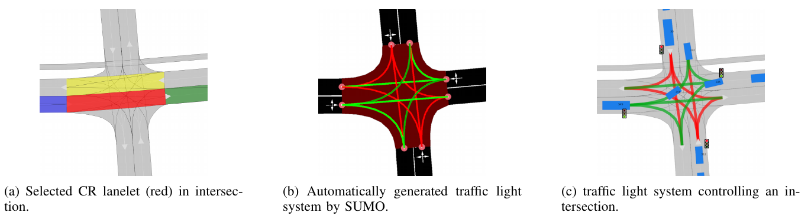

..
  Normally, there are no heading levels assigned to certain characters as the structure is
  determined from the succession of headings. However, this convention is used in Python’s
  Style Guide for documenting which you may follow:

  # with overline, for parts
  * for chapters
  = for sections
  - for subsections
  ^ for subsubsections
  " for paragraphs

Vehicle Simulation using Simulation of Urban Mobility (SUMO)
############################################################
Simulation of Urban Mobility `(SUMO) <https://sumo.dlr.de/docs/index.html>`_ is a microscopic
traffic simulator which is able to simulate traffic
participants, given a road network in it’s own graph like format
of nodes and edges.

Quick Start Guide
*****************
To simulate traffic on a CommonRoad Scenario, you firstly need to install SUMOs dependencies.

Command Line Interface
========================

Want to quickly convert an OSM file detailing an OSM map to a XML file with a CommonRoad scenario?

Use the command
``crdesigner map-convert-sumo -i input-file.net.xml -o output-file.xml``.

.. note::
   You have to activate the Python environment in which the CommonRoad Scenario Designer is
   installed before using the command line.

For example, ``crdesigner map-convert-sumo -i test.net.xml -o new_converted_file_name.xml``
produces a file called *new_converted_file_name.xml*

.. note::
   If no output file name is specified, the converted file will be called input-file.xml,
   e.g., ``crdesigner map-convert-sumo -i test.net.xml`` produces a file called *test.xml*.

You can also use the GUI to convert an OpenDRIVE file.
The GUI can be started from command line with ``crdesigner`` or ``crdesigner gui``.

Python APIs
============

.. code:: python

    import os
    import numpy as np
    from lxml import etree
    import uuid

    from commonroad.common.file_reader import CommonRoadFileReader
    from commonroad.common.file_writer import CommonRoadFileWriter, OverwriteExistingFile
    from commonroad.visualization.mp_renderer import MPRenderer

    from crdesigner.input_output.api import commonroad_to_sumo

    from crdesigner.input_output.gui.toolboxes.gui_sumo_simulation import SUMO_AVAILABLE
    if SUMO_AVAILABLE:
        from crdesigner.map_conversion.sumo_map.config import SumoConfig
        from crdesigner.map_conversion.sumo_map.cr2sumo.converter import CR2SumoMapConverter
        from sumocr.interface.sumo_simulation import SumoSimulation
        from sumocr.visualization.video import create_video

    output_folder = ""  # replace empty string
    scenario_name = ""  # replace empty string
    input_file = os.path.join(output_folder, scenario_name + '.xml')

    scenario, planning_problem = CommonRoadFileReader(input_file).open()

    # ----------------------------------------------- Option 1: General API ------------------------------------------------
    commonroad_to_sumo(input_file, output_folder)

    # ------------------------------------------ Option 2: SUMO conversion APIs --------------------------------------------
    try:
        commonroad_reader = CommonRoadFileReader(input_file)
        scenario, _ = commonroad_reader.open()
    except etree.XMLSyntaxError as xml_error:
        print(f"SyntaxError: {xml_error}")
        print(
            "There was an error during the loading of the selected CommonRoad file.\n")

    if SUMO_AVAILABLE:
        config = SumoConfig.from_scenario_name(str(uuid.uuid4()))
        config.scenario_name = scenario_name
        converter = CR2SumoMapConverter(scenario, config)
        converter.create_sumo_files(output_folder)

    # -------------------- Option 3: SUMO conversion APIs with Traffic Simulation and Video Creation -----------------------

    # translate scenario to center
    centroid = np.mean(np.concatenate(
        [la.center_vertices for la in scenario.lanelet_network.lanelets]),
        axis=0)
    scenario.translate_rotate(-centroid, 0)
    planning_problem.translate_rotate(-centroid, 0)

    config = SumoConfig.from_scenario_name(scenario_name)

    # convert CR to sumo net
    wrapper = CR2SumoMapConverter(scenario, config)
    wrapper.create_sumo_files(output_folder)
    tls_lanelet_id = 43513
    traffic_light_system_generated = wrapper.auto_generate_traffic_light_system(tls_lanelet_id)

    print(f"Generated Traffic Light System at {tls_lanelet_id}, {traffic_light_system_generated}")

    # draw scenario after traffic light generation
    rnd = MPRenderer()
    wrapper.lanelet_network.draw(rnd)
    rnd.render(show=True)

    # write generated traffic lights back to commonroad file
    scenario.lanelet_network = wrapper.lanelet_network

    # run Simulation
    simulation = SumoSimulation()
    simulation.initialize(config, wrapper)

    for t in range(config.simulation_steps):
        simulation.simulate_step()

    simulation.stop()

    # save resulting scenario
    simulated_scenario = simulation.commonroad_scenarios_all_time_steps()
    CommonRoadFileWriter(simulated_scenario,
                         planning_problem,
                         author=scenario.author,
                         affiliation=scenario.affiliation,
                         source=scenario.source,
                         tags=scenario.tags,
                         location=scenario.location).write_scenario_to_file(
        os.path.join(output_folder,
                     config.scenario_name + ".simulated.xml"),
        overwrite_existing_file=OverwriteExistingFile.ALWAYS)

    print("creating video (this may take some time)")
    create_video(simulation.commonroad_scenarios_all_time_steps(),
                 output_folder, trajectory_pred=simulation.ego_vehicles)

In order to use the API calls, the save_path and Benchmark_ID has to be set in the config file.
The config file can be found at */crdesigner/conversion/osm2cr* and is described in detail at the end of this document.

The GUI provides also functionality to edit already the OSM graph structure before converting to CommonRoad.

Implementation Details
**************
In SUMO, nodes represent ends of edges or other fixed position objects (eg. traffic signs) and are connected by edges.
Each edge in turn can consist of multiple lanes.
Realistic traffic constraints such as traffic lights and partially traffic signs can also be modelled.
Additionally it provides the capability to simulate multiple types of traffic participants and interactions between them.
Optionally trips for pedestrians and vehicles from one edge in the network to another can be automatically generated.
SUMO also provides a set of tools for programmatically interacting with a network, namely NETEDIT.

The main module of the converter is in ``crdesigner/map_conversion/sumo_map/cr2sumo/converter.py``. Here, a
CommonRoad Scenario is converted to its representation as a SUMO Net. This SUMO Net is then
used as the specification for simulating vehicles with SUMO.

In detail, conversion follows roughly the following steps, which are successively called in
``_convert_map()``:

1. Find lanes from lanelets
2. Initialize SUMO Nodes
3. Create Lanes and Edges from Lanelets
4. Initialize Connections between Lanes
5. Merge overlapping lanelets into a single junction
6. Remove merged edges
7. Create Lane based connections
8. Create pedestrian crossings
9. Encode Traffic Signs from CR file
10. Encode Traffic Lights from CR file

Dynamic Obstacle Simulation with SUMO
=====================================

(mf) Simulation of traffic participants different from an ego-vehicle is
handled by SUMO, which utilizes it’s own network format, more details in.
We will not go into detail on the network conversion but focus on
LaneletType conversion in. Afterwards, random trips are generated by
SUMO for each traffic participant, details in. Then the user can
optionally have our tool automatically generate traffic lights at
intersections in :numref:`lanelet_type_conversion`. Finally the simulation SUMO simulation is executed
and the results converted back to CommonRoad.

.. _lanelet_type_conversion:
.. figure:: images/sumo/converted_sumo_crossing.png
   :alt: Converted CommonRoad lanelet intersections and crossings (left) to SUMO networks (right)
   :name: fig:sumo_lanelet_types:cr_intersection

   Converted CommonRoad lanelet intersections and crossings (left) to SUMO networks (right)

Lanelet type conversion
=======================

In CommonRoad, every lanelet has one or more LaneletTypes describing the
type of a Lanelet and giving an indication of
usage. However in SUMO each lane can be assigned to one or more ``vClass`` attributes,
which define
what type of vehicle is allowed to use the respective lane. To convert
from one representation to the other we therefore propose a mapping
:math:`t: \mathbb{P}(\texttt{LaneletType}) \rightarrow \mathbb{P}(\texttt{vClass})`
mapping the set of all CommoRoad Lanelet types to the set of all
vClasses. Every converted SUMO lane is then assigned a set of vClasses
according to the LaneletTypes of the corresponding CommonRoad lanelet
under the mapping :math:`t`.

When converting intersections from CommonRoad to SUMO all overlapping
lanelets are merged into a SUMO junction object. However, in this
process we need to avoid adding junctions for lanelets of different
types, to not create additional junctions during the conversion which are
not present in the source CommonRoad file. Therefore, we propose to only
merge two lanelets Lanelet types :math:`L_1, L_2` iff.

.. math:: t(L_1) \cap t(L_2) \neq \emptyset

This results in SUMO junctions being merged correctly as given in ,
where the overlapping Lanelets of one type (*urban*) in are merged into
one junction in. In two crossing paths of different types are given.
The horizontal one being of different type to the vertical roads
(*crosswalk* and *urban*) so no SUMO junction is generated between the
two in :numref:`lanelet_type_conversion`.

Pedestrian path generation
==========================

Pedestrian paths through the network are randomly generated in a similar
fashion as the already existing vehicle trips, by using the random trips
functionality provided by SUMO. This built in functionality generates
trips (start, to end edge) randomly based on distributions provided for
each allowed ``vClass`` on a lane. Therefore, the need to explicitly 
specify which vehicles classes should be generated is removed.
Interaction between the different types then occurs during the
simulation based on each agent having to wait at intersections and
following traffic rules.

.. _traffic_light_conversion:

   Automatic traffic light generation process (from left to right)

Traffic Light conversion & generation
=====================================

Traffic lights in CommonRoad are specified by one or more lanelets
referencing them. Their placement is per default at the end of the
referencing lanelet.
Optionally a position can be explicitly defined for more detailed
placement at the side of the road. The cycle information describing 
each phase of traffic lights are represented identically to CommonRoad 
by the tuple :math:`(\text{color}, \text{duration})`.
However, SUMO represents time in
seconds :math:`(sec)` and CommonRoad in multiples of the timestep
:math:`n \cdot \Delta t, n \in \mathbb{N}_0`, forcing conversion between
the two systems. Traffic lights converted to SUMO are then simulated,
and their resulting effects on the dynamic obstacles are imported back
to a CommonRoad scenario.

Additionally we propose the generation of traffic light systems with
collision free cycles at intersections. This generation is done by:

#. Having the user select a lanelet in the network, which lies in an
   intersection. The selected lanelet has to lie in an intersection, as
   SUMO only allows for placement of traffic lights at SUMO junctions.
   Therefore the converter has to make sure, a selected lanelet lies in
   an intersection, which is converted to a SUMO junction.

#. Mapping the selected lanelet to the corresponding SUMO junction and
   generating the traffic light system for the whole intersection using
   SUMOs built in tool ``NETEDIT``.

#. Converting the generated traffic light back to CommonRoad. This
   involves reversing the conversion process for CommonRoad traffic
   lights to SUMO described in the previous paragraph.

Visually this process is shown in :numref:`traffic_light_conversion`.
The first image shows how a user selected a lanelet, which is displayed
in red. Other colors in this figure are representing adjaceny information.
The second image shows the generated traffic light system (a set of traffic 
lights associated with each other by an intersection) in SUMO. Cycle
states of each traffic light is shown by their respective colors.
The collision-free generation of the cycles is visualized by opposing lanes
having the same color. The last image displays the conversion result of the 
generated traffic lights.

