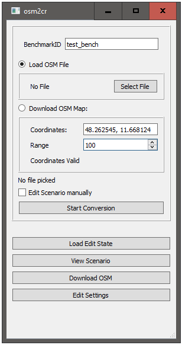
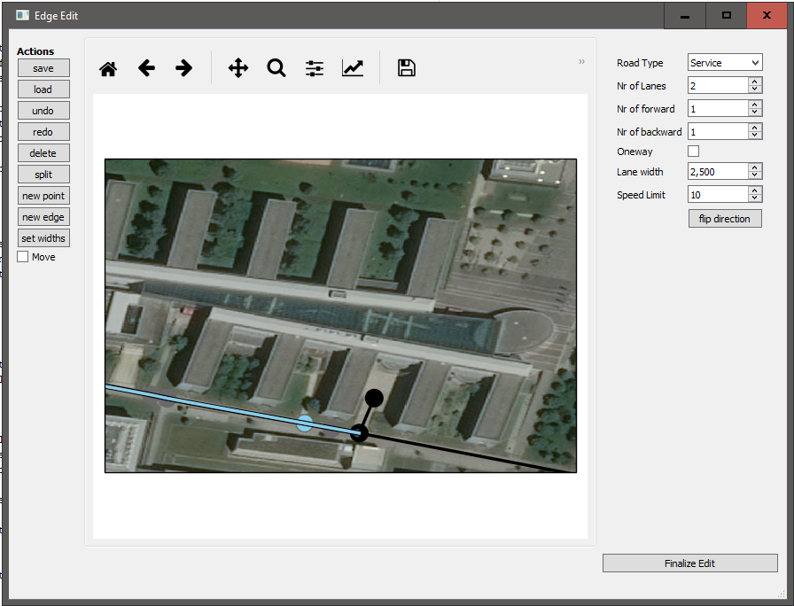
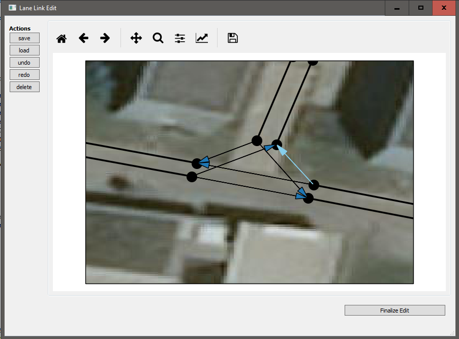

How to use the GUI
==================

Start
-----

Start the gui by executing **main.py** with **gui** or **g** as a parameter::

    $ python main.py g

Then the following window will show up:

* You can specify the name of the scenario in the text edit next to **BenchmarkID**
* To convert an already downloaded OSM map, click the **Select File** Button
* If you want to download and convert a scenario, set the checkbox **Download OSM Map**, enter the coordinates
  of the center of your scenario and the radius of the downloaded area
* It is also possible to download the selected area without converting it by clicking **Download OSM**.
  The OSM map will be saved in the *files* folder under the name specified as BenchmarkID above.
* If you want to edit the scenario during the conversion check **Edit Scenario Manually**
* Saved states of editing can also be reloaded from here. Press **Load Edit State** to do so.
  **Warning** These edit states are pickled objects. Do never load states from insecure sources.
  This allows an attacker to execute arbitrary code on your computer
* **View Scenario** lets you display a CommonRoad scenario
* The parameters of the tool can be edited by clicking **Edit Settings**

Edge Edit
---------

In the conversion process, road networks are represented as **nodes** and **edges**.
An edge represents a road and a node represents an intersection. At the ends of every edge is a node.
In the first window of the Edit GUI you can edit these edges and nodes.

In the middle is a matplotlib plot of the road network.
You can zoom and drag it as described in the `matplotlib manual <https://matplotlib.org/users/navigation_toolbar.html>`_.

You can edit the graph within the plot.
Select nodes and edges by clicking on them.
When an edge is selected, its way points are displayed.
You will also see each of its lanes and their direction around it.
Additionally some properties of the edge will be displayed on the right of the window.
You can edit the se properties.
Drag nodes and way points with drag and drop (Note that you can only drag objects when *move* is toggled on).

At the left are several buttons, which allow you to perform actions to modify the graph.
Each of those is also available via shortcut:

* **save** (ctrl+s): save the current edit state to disk
* **load** (ctrl+l): load an edit state
* **undo** (ctrl+z): undo the last action
* **redo** (ctrl+shift+z): redo the last undone action
* **delete** (ctrl+del): deletes the selected object if possible
* **split** (ctrl+d): dissect the currently selected edge at the currently selected way point.
  This creates a new node from which you can create new edges.
* **new** point (ctrl+n): creates a new way point after the selected way point for the selected edge
* **new edge** (ctrl+e): allows to create a new edge starting at the selected node.
  When this action is started, you can create new way points for the edge with a left click on the map.
  To finalize the creation of an edge right click, either on an existing node or on  the map to create a new node.
* **set widths** (ctrl+w): opens a window to reset the width of all lanes
  (this will also overwrite changes you made for individual edges)
* **move** (ctrl+m): toggles move on and of. Only if move is on, you can drag nodes and way points

You can delete single way points of an edge you select them.
It is also possible to delete an edge as a whole.
Nodes can only be deleted if the have no adjacent edges.

If you are done with editing the edges you can go on by clicking **Finalize Edit**.

Lane Link Edit
--------------

In this edit GUI you can modify the links between to lanes.
The conversion process now created lanes for each road, but not yet the courses at intersections.
If a lane can be reached from another lane, this link is represented by an arrow.
The central course of each lane is represented by a black line.
The start and end points of each lane are represented by black dots.

You can delete and create new arrows.
Click on an arrow to select it.
A new arrow can be created by pressing the left mouse button down on the end point of a lane and
releasing it at the start point of another lane.
To delete an arrow, select it and press ctrl+del.

The actions in this GUI are similar to the edge edit GUI:

* **save** (ctrl+s): save the current edit state to disk
* **load** (ctrl+l): load an edit state
* **undo** (ctrl+z): undo the last action
* **redo** (ctrl+shift+z): redo the last undone action
* **delete** (ctrl+del): deletes the selected object if possible

If you are done with editing the links you can go on by clicking **Finalize Edit**.
Then you are asked to select a file to save the resulting scenario at and the conversion finishes.

All modifications other than lane links must be done before in the edge edit GUI.

Aerial Images
-------------
It is possible to display aerial images in the edit GUIs.
To do so check **Show Aerial Images** in the settings and insert your Bing Maps Key in the corresponding edit.
To acquire a Bing Maps Key, follow `Bings tutorial <https://docs.microsoft.com/en-us/bingmaps/getting-started/bing-maps-dev-center-help/getting-a-bing-maps-key>`_.

Cropping Scenarios
------------------

If you want to convert only a small part of an OSM map it is advisable to not remove the edges one by one with this
tool.
Instead you can edit the OSM map before loading it in this tool with `JOSM <https://josm.openstreetmap.de/>`_.
