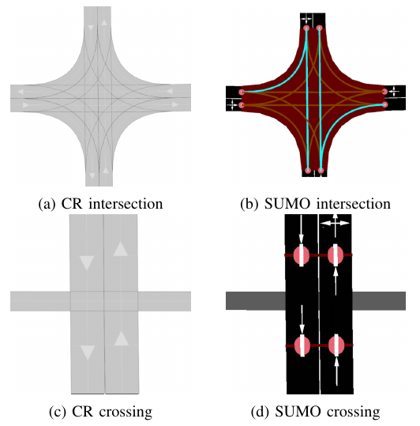
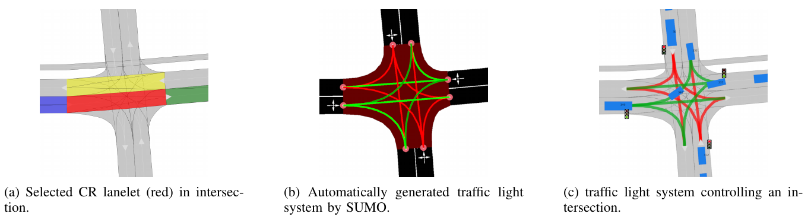

# Vehicle Simulation using Simulation of Urban Mobility (SUMO)

Simulation of Urban Mobility [SUMO](https://sumo.dlr.de/docs/index.html) is a microscopic
traffic simulator which is able to simulate traffic
participants, given a road network in its own graph like format of nodes and edges.

## Usage
The SUMO conversions can be used via:

- command line interface
- GUI
- Python API

For the relevant command line commands execute
``crdesigner --help``.
Tutorials on how to use the Python APIs can be found in our
[GitHub repository](https://github.com/CommonRoad/commonroad-scenario-designer/tree/develop/tutorials/conversion_examples).

## Implementation Details
In SUMO, nodes represent ends of edges or other fixed position objects (eg. traffic signs) and are connected by edges.
Each edge in turn can consist of multiple lanes.
Realistic traffic constraints such as traffic lights and partially traffic signs can also be modelled.
Additionally, it provides the capability to simulate multiple types of traffic participants and interactions between them.
Optionally trips for pedestrians and vehicles from one edge in the network to another can be automatically generated.
SUMO also provides a set of tools for programmatically interacting with a network, namely NETEDIT.

The main module of the converter is in ``crdesigner/map_conversion/sumo_map/cr2sumo/converter.py``.
Here, a CommonRoad Scenario is converted to its representation as a SUMO Net.
This SUMO Net is then used as the specification for simulating vehicles with SUMO.

In detail, conversion follows roughly the following steps, which are successively called in
``_convert_map()``:

1. Find lanes from lanelets
2. Initialize SUMO Nodes
3. Create Lanes and Edges from Lanelets
4. Initialize Connections between Lanes
5. Merge overlapping lanelets into a single junction
6. Remove merged edges
7. Create Lane based connections
8. Create pedestrian crossings
9. Encode Traffic Signs from CR file
10. Encode Traffic Lights from CR file

### Dynamic Obstacle Simulation with SUMO

Simulation of traffic participants different from an ego-vehicle is
handled by SUMO, which utilizes its own network format, more details in.
We will not go into detail on the network conversion but focus on
LaneletType conversion in. Afterward, random trips are generated by
SUMO for each traffic participant, details in. Then the user can
optionally have our tool automatically generate traffic lights at
intersections in `lanelet_type_conversion`.
Finally, the simulation SUMO simulation is executed
and the results converted back to CommonRoad.

Converted CommonRoad lanelet intersections and crossings (left) to SUMO networks (right):

### Lanelet type conversion

In CommonRoad, every lanelet has one or more LaneletTypes describing the type of Lanelet and giving an indication of
usage.
However, in SUMO each lane can be assigned to one or more ``vClass`` attributes,
which define
what type of vehicle is allowed to use the respective lane. To convert
from one representation to the other we propose a mapping of the set of all
CommonRoad Lanelet types to the set of all
vClasses. Every converted SUMO lane is then assigned a set of vClasses
according to the LaneletTypes of the corresponding CommonRoad lanelet.

When converting intersections from CommonRoad to SUMO all overlapping
lanelets are merged into a SUMO junction object. However, in this
process we need to avoid adding junctions for lanelets of different
types, to not create additional junctions during the conversion which are
not present in the source CommonRoad file. Therefore, we propose to only
merge two lanelets Lanelet types if they share common elements.
This results in SUMO junctions being merged correctly as given in ,
where the overlapping Lanelets of one type (*urban*) in are merged into
one junction in. In two crossing paths of different types are given.
The horizontal one being of different type to the vertical roads
(*crosswalk* and *urban*) so no SUMO junction is generated between the
two in `lanelet_type_conversion`.

### Pedestrian path generation

Pedestrian paths through the network are randomly generated in a similar
fashion as the already existing vehicle trips, by using the random trips
functionality provided by SUMO. This built in functionality generates
trips (start, to end edge) randomly based on distributions provided for
each allowed ``vClass`` on a lane. Therefore, the need to explicitly
specify which vehicles classes should be generated is removed.
Interaction between the different types then occurs during the
simulation based on each agent having to wait at intersections and
following traffic rules.

Automatic traffic light generation process (from left to right):

### Traffic Light conversion & generation

Traffic lights in CommonRoad are specified by one or more lanelets
referencing them. Their placement is per default at the end of the
referencing lanelet.
Optionally a position can be explicitly defined for more detailed
placement at the side of the road. The cycle information describing
each phase of traffic lights are represented identically to CommonRoad.
However, SUMO represents time in
seconds and CommonRoad in multiples of the timestep, forcing conversion between
the two systems. Traffic lights converted to SUMO are then simulated,
and their resulting effects on the dynamic obstacles are imported back
to a CommonRoad scenario.

Additionally, we propose the generation of traffic light systems with
collision free cycles at intersections. This generation is done by:

- Having the user select a lanelet in the network, which lies in an
   intersection. The selected lanelet has to lie in an intersection, as
   SUMO only allows for placement of traffic lights at SUMO junctions.
   Therefore, the converter has to make sure, a selected lanelet lies in
   an intersection, which is converted to a SUMO junction.

- Mapping the selected lanelet to the corresponding SUMO junction and
   generating the traffic light system for the whole intersection using
   SUMOs built in tool ``NETEDIT``.

- Converting the generated traffic light back to CommonRoad. This
   involves reversing the conversion process for CommonRoad traffic
   lights to SUMO described in the previous paragraph.

Visually this process is shown in `traffic_light_conversion`.
The first image shows how a user selected a lanelet, which is displayed
in red. Other colors in this figure are representing adjaceny information.
The second image shows the generated traffic light system (a set of traffic
lights associated with each other by an intersection) in SUMO. Cycle
states of each traffic light is shown by their respective colors.
The collision-free generation of the cycles is visualized by opposing lanes
having the same color. The last image displays the conversion result of the
generated traffic lights.
